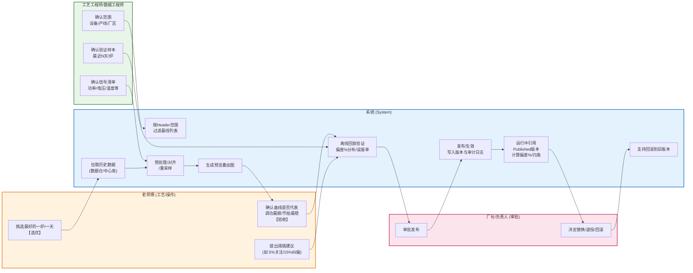

# 黄金基线建立流程泳道图

## 流程概述

本流程描述了从"选优"到"发布上线"的完整黄金基线建立过程，涉及四个角色：

| 角色 | 职责 | 颜色标识 |
|-----|------|---------|
| **老师傅 (工艺/操作)** | 选优、验收、提供阈值建议 | 🟠 橙色 |
| **工艺工程师/数据工程师** | 确认信号清单、范围、验证样本 | 🟢 绿色 |
| **系统 (System)** | 自动化处理：拉取、预处理、验证、发布 | 🔵 蓝色 |
| **厂长/负责人 (审批)** | 审批发布、决定回滚 | 🩷 粉色 |

---

## Mermaid 源码

---

## 流程详细说明

### 阶段一：准备与选优

| 步骤 | 角色 | 动作 |
|-----|------|------|
| 1 | 工艺工程师 | 确认信号清单（功率/电压/温度等） |
| 2 | 工艺工程师 | 确认范围（设备/产线/厂区） |
| 3 | **老师傅** | **挑选"最好的一炉/一天"【选优】** |

### 阶段二：数据处理与预览

| 步骤 | 角色 | 动作 |
|-----|------|------|
| 4 | 系统 | 按 Header 范围过滤基线列表 |
| 5 | 系统 | 拉取历史数据（从数据仓/中心库） |
| 6 | 系统 | 预处理/对齐/重采样 |
| 7 | 系统 | 生成预览叠加图 |
| 8 | **老师傅** | **确认曲线是否代表"调功最顺/节拍最稳"【验收】** |

### 阶段三：验证与审批

| 步骤 | 角色 | 动作 |
|-----|------|------|
| 9 | 老师傅 | 提出阈值建议（如 5%关注/15%纠偏） |
| 10 | 工艺工程师 | 确认验证样本（最近N天/炉） |
| 11 | 系统 | 离线回放验证（偏差%分布/误报率） |
| 12 | **厂长** | **审批发布** |

### 阶段四：发布与运维

| 步骤 | 角色 | 动作 |
|-----|------|------|
| 13 | 系统 | 发布/生效，写入版本与审计日志 |
| 14 | 系统 | 运行中引用 Published 版本，计算偏差%/归类 |
| 15 | 厂长 | 决定替换/退役/回滚 |
| 16 | 系统 | 支持回滚到旧版本 |

---

## 生成的图片文件

- **PNG**: `golden_baseline_swimlane.png`
- **SVG**: `golden_baseline_swimlane.svg`
