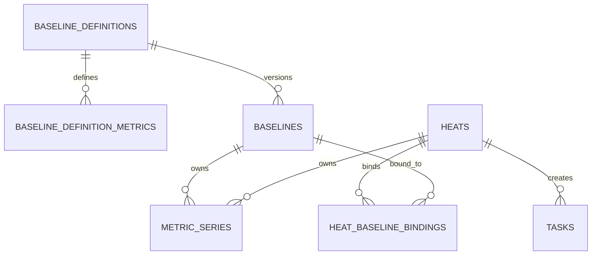

# 后端结构文档 (BACKEND_STRUCTURE)

## 1. 项目结构

```
apps/server/
├── src/
│   ├── main.py              # 应用入口
│   ├── config.py            # 配置管理
│   ├── database.py          # 数据库连接
│   │
│   ├── api/                  # API 路由
│   │   ├── __init__.py
│   │   ├── router.py         # 路由汇总
│   │   ├── baselines.py      # 基线 API
│   │   ├── heats.py          # 炉次 API
│   │   ├── tasks.py          # 任务 API
│   │   ├── reports.py        # 报表 API
│   │   └── settings.py       # 设置 API
│   │
│   ├── models/               # 数据模型 (SQLAlchemy)
│   │   ├── __init__.py
│   │   ├── baseline.py
│   │   ├── heat.py
│   │   ├── heat_baseline_binding.py
│   │   ├── heat_replay_job.py
│   │   ├── task.py
│   │   └── setting.py
│   │
│   ├── schemas/              # 数据模式 (Pydantic)
│   │   ├── __init__.py
│   │   ├── baseline.py
│   │   ├── heat.py
│   │   ├── heat_replay.py
│   │   ├── task.py
│   │   └── common.py
│   │
│   ├── services/             # 业务逻辑
│   │   ├── __init__.py
│   │   ├── formal_baseline_service.py
│   │   ├── formal_heat_service.py
│   │   ├── heat_stream_processor.py
│   │   ├── live_heat_runtime_service.py
│   │   ├── heat_replay_batch_service.py
│   │   ├── heat_runtime_advance_service.py
│   │   ├── deviation_service.py
│   │   ├── report_service.py
│   │   └── edc_client.py     # EDC API 客户端
│   │
│   └── utils/                # 工具函数
│       ├── __init__.py
│       └── pdf_generator.py
│
├── tests/                    # 测试
│   ├── conftest.py
│   ├── test_baselines.py
│   └── test_heats.py
│
├── alembic/                  # 数据库迁移
│   ├── versions/
│   └── env.py
│
├── pyproject.toml
└── alembic.ini
```

## 2. 数据模型

### 2.1 设计总览

本轮表结构按三类主表组织：

- 主数据主表：`baseline_definitions`
- 黄金基线业务主表：`baselines`
- 炉次业务主表：`heats`、`heat_baseline_bindings`

其余表作为从表或支撑表存在：

- `baseline_definition_metrics`：定义下的指标模板
- `metric_series`：基线或炉次的实际指标值
- `heat_replay_jobs`：历史初始化 / 历史重算任务
- `tasks`：业务任务
- `settings`：系统设置

关键约束：

- 除“当前正在发生的炉次”外，其余炉次都应进入 `heats`
- 历史炉次与黄金基线的绑定关系统一进入 `heat_baseline_bindings`
- 历史炉次的指标值统一存入 `metric_series`
- 基线版本不再把功率、电压等固定指标写死在主表字段里
- `baselines.is_default` 表示全系统当前默认黄金基线
- `baseline_definition_metrics.item` 表示 definition 内部的指标项号；`metric_series.item` 表示 owner 维度内部的指标项号，两者不默认等同于跨 definition 的全局指标身份
- `baselines.item` 表示“版本号项”
- `metric_series(owner_type='heat')` 的业务语义是“该炉次绑定到的所有基线所需指标并集”
- `heat_baseline_bindings` 是 `heat + baseline` 粒度分析结果的真相源；`heats` 不承担每条基线的分析结果
- 当前炉次运行态缓存应尽量与 `heats + heat_baseline_bindings + metric_series` 同构，避免再做一套单独字段语义
- 历史炉次的指标值应保留“`N-1 / N / N+1`”上下文窗口，便于后续单炉次人工调整与详情回看
- live runtime 主链的数据流转语义固定为：`source -> active_runtime(current) -> previous_runtime -> heats/metric_series/heat_baseline_bindings`
- live 刷新每轮只取一批源数据；源数据需要同步更新 `active_runtime` 与 `previous_runtime`，而不是为 sealed/history 再单独走一条取数与分析主链
- 冷启动 / 首次识别时允许 `previous_runtime` 为空；此时 `active_runtime` 允许只有当前炉次 `N` 本体，不强求带 `N-1`
- `previous_runtime` 的职责是承接上一炉次，并持续吸收来自下一炉次的 `N+1` 上下文；正式入库应优先使用已补全上下文的 `previous_runtime`
- 所有未确认的自动回退、自动补全、自动替换都不应进入正式业务链路
- live 主链只负责 `runtime + append confirmed sealed heats`
- 历史初始化 / 历史重算必须显式走 `heat_replay_jobs + replay_batch`，不再复用实时后台 loop

时间语义约束：

- 所有绝对时间统一存 `timestamp(ms)`，数据库字段使用整数毫秒值，不再使用 SQLite `DateTime` 作为业务真源
- 所有 API 输入输出统一传 `timestamp(ms)`，前端不再提交或依赖无时区 ISO 字符串
- 业务日期、整天范围、班次、日报分组、基线生效匹配等“本地时间语义”统一按 `settings.plant_timezone` 解释
- `plant_timezone` 默认值为 `Asia/Shanghai`

### 2.2 `baseline_definitions`

主数据主表。

| Index | 字段 | 类型 | 主键 | 必填 | 用途 |
|---|---|---:|---:|---:|---|
| 1 | `id` | `string(36)` | 是 | 是 | 基线定义 ID |
| 2 | `definition_name` | `string(100)` | 否 | 是 | 基线定义名称 |
| 3 | `description` | `text` | 否 | 否 | 基线定义说明 |
| 4 | `expected_duration_minutes` | `int` | 否 | 是 | 同产线口径下的预期炉次时长，用于一致性校验与展示 |
| 5 | `status` | `string(20)` | 否 | 是 | 定义状态，控制该定义是否还能继续创建新基线 |
| 6 | `created_by` | `string(50)` | 否 | 是 | 创建人 |
| 7 | `updated_by` | `string(50)` | 否 | 是 | 更新人 |
| 8 | `created_at` | `int64(timestamp_ms)` | 否 | 是 | 创建时间 |
| 9 | `updated_at` | `int64(timestamp_ms)` | 否 | 是 | 更新时间 |

样例：

```json
{
  "id": "def-std-melt",
  "definition_name": "标准熔炼基线",
  "description": "中频炉标准熔炼过程",
  "expected_duration_minutes": 30,
  "status": "active",
  "created_by": "wang",
  "updated_by": "wang",
  "created_at": 1775218200000,
  "updated_at": 1775218200000
}
```

业务语义补充：

- `definition` 在当前系统里表示“指标视角 / 分析视角”，不是另一套炉次切割解释器
- 同一条生产线下的多个 `definition` 共享同一条炉次与同一套切割周期，只是关注的指标集合不同
- `expected_duration_minutes` 仍保留在 `baseline_definitions`，但当前口径下它应在同产线各 `definition` 间保持一致；它不是区分多 `definition` runtime 的主要维度

### 2.3 `baseline_definition_metrics`

定义指标模板表。  
复合主键：

- `definition_id`
- `item`

这里的 `item` 表示指标项号，例如 `001 / 002 / 003`。

| Index | 字段 | 类型 | 主键 | 必填 | 用途 |
|---|---|---:|---:|---:|---|
| 1 | `definition_id` | `string(36)` | 是 | 是 | 所属基线定义 ID |
| 2 | `item` | `string(3)` | 是 | 是 | 指标项号，如 `001 / 002 / 003` |
| 3 | `item_kind` | `string(20)` | 否 | 是 | 固定写 `metric_item`，显式说明这里的 `item` 是指标项号 |
| 4 | `metric_key` | `string(50)` | 否 | 是 | 指标业务键 |
| 5 | `metric_name` | `string(100)` | 否 | 是 | 指标名称 |
| 6 | `unit` | `string(20)` | 否 | 否 | 单位 |
| 7 | `color` | `string(20)` | 否 | 是 | 图表颜色 |
| 8 | `sort_order` | `int` | 否 | 是 | 展示顺序 |
| 9 | `edc_channel_id` | `string(100)` | 否 | 否 | 当前绑定通道 ID |
| 10 | `source_channel_name` | `string(100)` | 否 | 否 | 通道名称快照 |
| 11 | `source_channel_label` | `string(255)` | 否 | 否 | 通道显示标签快照 |
| 12 | `enabled` | `bool` | 否 | 是 | 是否启用 |
| 13 | `created_at` | `int64(timestamp_ms)` | 否 | 是 | 创建时间 |
| 14 | `updated_at` | `int64(timestamp_ms)` | 否 | 是 | 更新时间 |

样例：

```json
[
  {
    "definition_id": "def-std-melt",
    "item": "001",
    "item_kind": "metric_item",
    "metric_key": "power",
    "metric_name": "总有功功率",
    "unit": "kW",
    "color": "#409EFF",
    "sort_order": 1,
    "edc_channel_id": "2752-01",
    "source_channel_name": "總有功功率",
    "source_channel_label": "A01 / 總有功功率 / kW",
    "enabled": true
  },
  {
    "definition_id": "def-std-melt",
    "item": "002",
    "item_kind": "metric_item",
    "metric_key": "voltage_a",
    "metric_name": "A相电压",
    "unit": "V",
    "color": "#67C23A",
    "sort_order": 2,
    "edc_channel_id": "2752-02",
    "source_channel_name": "A相電壓",
    "source_channel_label": "A01 / A相電壓 / V",
    "enabled": true
  }
]
```

### 2.4 `baselines`

基线版本表。  
复合主键：

- `definition_id`
- `item`

这里的 `item` 表示版本号项，例如 `001 / 002 / 003`。

| Index | 字段 | 类型 | 主键 | 必填 | 用途 |
|---|---|---:|---:|---:|---|
| 1 | `definition_id` | `string(36)` | 是 | 是 | 所属基线定义 ID |
| 2 | `item` | `string(3)` | 是 | 是 | 基线版本项，如 `001 / 002 / 003` |
| 3 | `item_kind` | `string(20)` | 否 | 是 | 固定写 `baseline_version`，显式说明这里的 `item` 是版本号 |
| 4 | `name` | `string(100)` | 否 | 是 | 基线名称 |
| 5 | `description` | `text` | 否 | 否 | 基线描述 |
| 6 | `status` | `string(20)` | 否 | 否 | 基线状态，允许为空 |
| 7 | `is_default` | `bool` | 否 | 是 | 是否默认黄金基线 |
| 8 | `source_heat_id` | `string(36)` | 否 | 否 | 可选的来源炉次定位 ID；允许为空 |
| 9 | `selected_start_time` | `int64(timestamp_ms)` | 否 | 是 | 选区开始时间 |
| 10 | `selected_end_time` | `int64(timestamp_ms)` | 否 | 是 | 选区结束时间 |
| 11 | `effective_from` | `int64(timestamp_ms)` | 否 | 是 | 生效时间 |
| 12 | `tolerance_percent` | `float` | 否 | 是 | 容许误差百分比 |
| 13 | `created_by` | `string(50)` | 否 | 是 | 创建人 |
| 14 | `updated_by` | `string(50)` | 否 | 是 | 更新人 |
| 15 | `created_at` | `int64(timestamp_ms)` | 否 | 是 | 创建时间 |
| 16 | `updated_at` | `int64(timestamp_ms)` | 否 | 是 | 更新时间 |
| 17 | `published_at` | `int64(timestamp_ms)` | 否 | 否 | 发布时间 |

样例：

```json
{
  "definition_id": "def-std-melt",
  "item": "001",
  "item_kind": "baseline_version",
  "name": "标准基线 v1",
  "description": "2026-04 第一版",
  "status": "published",
  "is_default": true,
  "source_heat_id": null,
  "selected_start_time": 1775218800000,
  "selected_end_time": 1775220540000,
  "effective_from": 1775222160000,
  "tolerance_percent": 15.0,
  "created_by": "wang",
  "updated_by": "wang",
  "created_at": 1775222160000,
  "updated_at": 1775222160000,
  "published_at": 1775222220000
}
```

补充约束：

- 基线创建的真源是 `selected_start_time + selected_end_time`，两者必须同时存在
- `selected_start_time / selected_end_time` 必须落在同一个 `settings.plant_timezone` 业务日内
- 基线曲线写入 `metric_series` 时，统一从该业务日的整天 preview 曲线按指标切片，不再要求必须绑定某个来源炉次
- `source_heat_id` 仅作为 UI 定位/回看辅助信息，可为空；为空时不影响基线创建、发布与 compare
- `is_default=1` 仅允许出现在 `status='published'` 的基线上，且同一时刻全系统最多一条

### 2.5 `metric_series`

指标值表。  
用于同时存：

- 基线版本里的指标值
- 炉次里的指标值

复合主键：

- `owner_key`
- `item`

| Index | 字段 | 类型 | 主键 | 必填 | 用途 |
|---|---|---:|---:|---:|---|
| 1 | `owner_key` | `string(80)` | 是 | 是 | 关联键；基线时指向 `{definition_id}:{baseline_item}`，炉次时指向 `heat_id` |
| 2 | `item` | `string(3)` | 是 | 是 | owner 内部指标项号；对 `baseline` 可对应 definition 内 item；对 `heat` 仅表示该炉次内部的自然序号/稳定排序号，不得再理解为任一 definition 内的指标项号 |
| 3 | `owner_type` | `string(20)` | 否 | 是 | 所属对象类型，`baseline / heat` |
| 4 | `definition_id` | `string(36)` | 否 | 否 | 所属基线定义 ID |
| 5 | `item_kind` | `string(20)` | 否 | 是 | 固定写 `metric_item`，说明这里的 `item` 是指标项号 |
| 6 | `metric_key` | `string(50)` | 否 | 是 | 指标业务键 |
| 7 | `metric_name` | `string(100)` | 否 | 是 | 指标名称 |
| 8 | `unit` | `string(20)` | 否 | 否 | 单位，可空 |
| 9 | `color` | `string(20)` | 否 | 是 | 指标颜色 |
| 10 | `sort_order` | `int` | 否 | 是 | 展示顺序 |
| 11 | `source_channel_id` | `string(100)` | 否 | 否 | 通道 ID 快照 |
| 12 | `source_channel_name` | `string(100)` | 否 | 否 | 通道名称快照 |
| 13 | `source_channel_label` | `string(255)` | 否 | 否 | 通道标签快照 |
| 14 | `series_json` | `text` | 否 | 是 | 指标完整窗口数据 JSON，包含该炉次自己的 `N-1 / N / N+1` 上下文窗口 |
| 15 | `stat_json` | `text` | 否 | 否 | 统计信息 JSON |
| 16 | `created_at` | `int64(timestamp_ms)` | 否 | 是 | 创建时间 |
| 17 | `updated_at` | `int64(timestamp_ms)` | 否 | 是 | 更新时间 |

样例（基线）：

```json
{
  "owner_key": "def-std-melt:001",
  "item": "001",
  "owner_type": "baseline",
  "definition_id": "def-std-melt",
  "item_kind": "metric_item",
  "metric_key": "power",
  "metric_name": "总有功功率",
  "unit": "kW",
  "color": "#409EFF",
  "sort_order": 1,
  "source_channel_id": "2752-01",
  "source_channel_name": "總有功功率",
  "source_channel_label": "A01 / 總有功功率 / kW",
  "series_json": [
    { "timestamp": 1775218800000, "value": 420.2 },
    { "timestamp": 1775218860000, "value": 422.5 }
  ]
}
```

样例（炉次）：

```json
{
  "owner_key": "heat-20260403-1740",
  "item": "001",
  "owner_type": "heat",
  "definition_id": "def-std-melt",
  "item_kind": "metric_item",
  "metric_key": "power",
  "metric_name": "总有功功率",
  "unit": "kW",
  "color": "#409EFF",
  "sort_order": 1,
  "source_channel_id": "2752-01",
  "source_channel_name": "總有功功率",
  "source_channel_label": "A01 / 總有功功率 / kW",
  "series_json": {
    "context_start_time": 1775217000000,
    "heat_start_time": 1775218800000,
    "heat_end_time": 1775220540000,
    "context_end_time": 1775222340000,
    "points": [
      { "timestamp": 1775217000000, "value": 32.1 },
      { "timestamp": 1775217060000, "value": 31.8 },
      { "timestamp": 1775218800000, "value": 430.1 },
      { "timestamp": 1775218860000, "value": 436.8 },
      { "timestamp": 1775220540000, "value": 28.6 },
      { "timestamp": 1775220600000, "value": 27.9 }
    ]
  },
  "stat_json": {
    "context_min": 27.9,
    "context_max": 449.2,
    "heat_min": 401.3,
    "heat_max": 449.2,
    "heat_avg": 426.4
  }
}
```

补充约束：

- `owner_type='heat'` 的 `metric_series` 表示“这条炉次自己的上下文曲线包”，不是全局时间线的唯一切片
- `owner_type='heat'` 的 `metric_series` 应保存该炉次所绑定全部基线视角需要的指标并集，例如 `N1={B1,B2,B3}`、`N2={B1,B2,B10}` 时，`heat` 侧应至少保存 `B1/B2/B3/B10`
- `owner_type='heat'` 的指标身份以 `metric_key` 为主；`item` 只表示该 `owner_key` 下的稳定排序项，不应再默认解释成“来自 primary definition 的 item 编号”
- 每条炉次的 `metric_series` 都应自带 `N-1 / N / N+1` 观察余量，便于详情页直接从 DB 拼接显示
- 不同炉次的 `metric_series` 时间范围允许彼此覆盖，这不代表重复数据错误
- `metric_series(owner_type='heat')` 只负责保存炉次自己的指标曲线真源，不负责保存每条基线的偏离分析结果

### 2.6 `heat_baseline_bindings`

炉次与黄金基线的正式绑定表。

复合主键：

- `heat_id`
- `baseline_definition_id`
- `baseline_item`

| Index | 字段 | 类型 | 主键 | 必填 | 用途 |
|---|---|---:|---:|---:|---|
| 1 | `heat_id` | `string(36)` | 是 | 是 | 炉次 ID |
| 2 | `baseline_definition_id` | `string(36)` | 是 | 是 | 绑定的基线定义 ID |
| 3 | `baseline_item` | `string(3)` | 是 | 是 | 绑定的基线版本项 |
| 4 | `is_primary` | `bool` | 否 | 是 | 是否该炉次的主黄金基线 |
| 5 | `effective_from_snapshot` | `int64(timestamp_ms)` | 否 | 否 | 绑定时的基线生效时间快照 |
| 6 | `tolerance_percent_snapshot` | `float` | 否 | 否 | 绑定时容许误差快照 |
| 7 | `analysis_status` | `string(20)` | 否 | 是 | 分析状态，`ready / waiting / unsupported / failed` |
| 8 | `analysis_reason` | `string(50)` | 否 | 否 | 稳定机器码，例如 `metric_points_insufficient / metric_scale_invalid / analysis_exception` |
| 9 | `analysis_message` | `string(255)` | 否 | 否 | 用户可读分析消息，例如“不适用”“数据不足”“分析失败” |
| 10 | `deviation_score` | `float` | 否 | 否 | 该绑定的统一偏离分数 |
| 11 | `avg_deviation_score` | `float` | 否 | 否 | 该绑定的平均偏离分数 |
| 12 | `analysis_details_json` | `text` | 否 | 否 | 该绑定的统一分析详情 JSON |
| 13 | `abnormal_duration_minutes` | `float` | 否 | 否 | 该绑定的连续异常时长 |
| 14 | `created_at` | `int64(timestamp_ms)` | 否 | 是 | 创建时间 |
| 15 | `updated_at` | `int64(timestamp_ms)` | 否 | 是 | 更新时间 |

样例：

```json
{
  "heat_id": "heat-20260403-1740",
  "baseline_definition_id": "def-std-melt",
  "baseline_item": "001",
  "is_primary": true,
  "effective_from_snapshot": 1775222160000,
  "tolerance_percent_snapshot": 15,
  "analysis_status": "ready",
  "analysis_reason": null,
  "analysis_message": null,
  "deviation_score": 3.82,
  "avg_deviation_score": 2.47,
  "analysis_details_json": {
    "abnormal_ranges": [
      { "start": 1775219220000, "end": 1775219460000, "score": 4.16 }
    ]
  },
  "abnormal_duration_minutes": 3,
  "created_at": 1775220720000,
  "updated_at": 1775220780000
}
```

补充约束：

- 一条记录只表达“某炉次绑定某基线”以及该绑定自己的分析结果
- `is_primary` 由炉次固化时确定，用于列表摘要和详情默认展示
- 历史炉次的偏离结果真源不再放在 `heats`，而是放在该表
- 该表按 `heat + baseline` 粒度承载 `analysis_status / analysis_reason / analysis_message / deviation_score / avg_deviation_score / abnormal_duration_minutes / analysis_details_json`
- `heats` 只保留炉次事实字段；若接口需要顶层摘要值，应从 `is_primary=1` 的绑定记录派生，而不是把每条基线分析结果直接并入 `heats`
- `analysis_status` 的正式业务语义固定为：
  - `ready`：已成功完成偏离分析
  - `waiting`：当前缺数据、缺曲线或缺上下文，后续 refresh/replay 后仍有机会转成 `ready`
  - `unsupported`：当前模型不适用，继续 refresh 也不会自动转成 `ready`
  - `failed`：分析执行异常，属于系统错误
- `analysis_reason` 是稳定机器码；`analysis_message` 是用户可读消息；两者都不应再让前端从 `analysis_details_json` 猜测
- `metric_scale_invalid` 必须落为 `analysis_status='unsupported'`，不能再继续混入 `waiting`
- `analysis_details_json` 继续保留完整调试与明细结构，但不再承担对外主状态字段的职责
- 对外业务状态不再使用笼统的 `pending` 作为正式展示值；若仍保留兼容字段，必须在接口层映射为 `waiting / unsupported / failed / ready`

### 2.7 `heats`

业务主表。  
除“当前正在发生的炉次”外，其余炉次都应进入这张表。  
本表除炉次主业务起止时间外，还保留编辑/回看所需的上下文窗口时间。

| Index | 字段 | 类型 | 主键 | 必填 | 用途 |
|---|---|---:|---:|---:|---|
| 1 | `id` | `string(36)` | 是 | 是 | 炉次 ID |
| 2 | `heat_no` | `string(50)` | 否 | 是 | 炉次编号 |
| 3 | `description` | `text` | 否 | 否 | 炉次备注 |
| 4 | `furnace_id` | `string(50)` | 否 | 否 | 炉号/设备 ID |
| 5 | `start_time` | `int64(timestamp_ms)` | 否 | 是 | 开始时间 |
| 6 | `end_time` | `int64(timestamp_ms)` | 否 | 是 | 结束时间 |
| 7 | `context_start_time` | `int64(timestamp_ms)` | 否 | 是 | 上下文窗口开始时间，通常覆盖 `N-1 -> N` 观察区间起点 |
| 8 | `context_end_time` | `int64(timestamp_ms)` | 否 | 是 | 上下文窗口结束时间，通常覆盖 `N -> N+1` 观察区间终点 |
| 9 | `is_manually_adjusted` | `bool` | 否 | 是 | 是否已被用户手动修改并保存 |
| 10 | `sealed_at` | `int64(timestamp_ms)` | 否 | 是 | 固化入库时间 |
| 11 | `source_kind` | `string(30)` | 否 | 是 | 来源类型 |
| 12 | `cut_reason` | `string(100)` | 否 | 否 | 切割原因 |
| 13 | `cut_status` | `string(30)` | 否 | 是 | 切割状态 |
| 14 | `status` | `string(20)` | 否 | 是 | 炉次状态 |
| 15 | `created_by` | `string(50)` | 否 | 否 | 创建人 |
| 16 | `updated_by` | `string(50)` | 否 | 否 | 更新人 |
| 17 | `created_at` | `int64(timestamp_ms)` | 否 | 是 | 创建时间 |
| 18 | `updated_at` | `int64(timestamp_ms)` | 否 | 是 | 更新时间 |

样例：

```json
{
  "id": "heat-20260403-1740",
  "heat_no": "H20260403-1740",
  "furnace_id": "Furnace-A01",
  "start_time": 1775218800000,
  "end_time": 1775220540000,
  "context_start_time": 1775217000000,
  "context_end_time": 1775222340000,
  "is_manually_adjusted": false,
  "sealed_at": 1775220720000,
  "source_kind": "live_inferred",
  "cut_reason": null,
  "cut_status": "normal",
  "status": "normal"
}
```

补充约束：

- `heats` 只保存炉次事实，不再存单条基线绑定结果
- `start_time / end_time` 表示这条炉次自己的主业务区间，不要求在全局时间线上绝对不重叠
- 自动固化路径应尽量按时间顺序生成炉次，通常不会自然产生重复炉次
- 若用户在页面上手动修正并保存某条炉次，允许该炉次与相邻炉次在 `start_time / end_time` 上出现合法 overlap
- `is_manually_adjusted=1` 表示该炉次已经被用户手动保存过修改
- 列表摘要里的 `baseline_id / deviation_score / abnormal_duration_minutes` 由 `heat_baseline_bindings.is_primary=1` 派生

### 2.8 `tasks`

| Index | 字段 | 类型 | 主键 | 必填 | 用途 |
|---|---|---:|---:|---:|---|
| 1 | `id` | `string(36)` | 是 | 是 | 任务 ID |
| 2 | `task_no` | `string(50)` | 否 | 是 | 任务编号 |
| 3 | `heat_id` | `string(36)` | 否 | 是 | 对应炉次 ID |
| 4 | `baseline_definition_id_snapshot` | `string(36)` | 否 | 否 | 任务创建时基线定义快照 |
| 5 | `baseline_item_snapshot` | `string(3)` | 否 | 否 | 任务创建时基线版本项快照 |
| 6 | `deviation_score` | `float` | 否 | 否 | 偏离分数快照 |
| 7 | `analysis_snapshot_json` | `text` | 否 | 是 | 统一分析详情快照 |
| 8 | `cause_analysis` | `text` | 否 | 否 | 原因分析 |
| 9 | `improvement` | `text` | 否 | 否 | 改善措施 |
| 10 | `prevention` | `text` | 否 | 否 | 预防措施 |
| 11 | `status` | `string(20)` | 否 | 是 | 任务状态 |
| 12 | `created_at` | `int64(timestamp_ms)` | 否 | 是 | 创建时间 |
| 13 | `updated_at` | `int64(timestamp_ms)` | 否 | 是 | 更新时间 |
| 14 | `completed_at` | `int64(timestamp_ms)` | 否 | 否 | 完成时间 |

### 2.9 `settings`

只存系统设置，不再承担主业务历史台账。

| Index | 字段 | 类型 | 主键 | 必填 | 用途 |
|---|---|---:|---:|---:|---|
| 1 | `key` | `string(100)` | 是 | 是 | 设置项键 |
| 2 | `value` | `text` | 否 | 是 | 设置值 |
| 3 | `description` | `string(255)` | 否 | 否 | 设置说明 |
| 4 | `updated_at` | `int64(timestamp_ms)` | 否 | 是 | 更新时间 |

关键设置项：

- `plant_timezone`: 工厂业务时区，默认 `Asia/Shanghai`
- `work_start_time / work_end_time / break_periods`: 作为 `plant_timezone` 下的本地时间规则解释

补充约束：

- `settings.active_baseline_id` 目前仍可作为运行态遗留字段保留，但不再是正式黄金基线真源
- 默认黄金基线真源统一为 `baselines.is_default`

### 2.10 `heat_replay_jobs`

历史初始化 / 历史重算任务表。

| Index | 字段 | 类型 | 主键 | 必填 | 用途 |
|---|---|---:|---:|---:|---|
| 1 | `id` | `string(64)` | 是 | 是 | replay 任务 ID |
| 2 | `job_kind` | `string(32)` | 否 | 是 | 任务类型，当前为 `replay_batch` |
| 3 | `status` | `string(24)` | 否 | 是 | `queued / running / completed / failed / cancelled` |
| 4 | `anchor_time` | `int64(timestamp_ms)` | 否 | 是 | 起始时间 |
| 5 | `end_time` | `int64(timestamp_ms)` | 否 | 是 | 结束时间 |
| 6 | `channel_key` | `string(64)` | 否 | 是 | 本次 replay 针对的通道键 |
| 7 | `force_replace` | `bool` | 否 | 是 | 是否按范围强制替换正式表 |
| 8 | `cutting_config_snapshot_json` | `text` | 否 | 是 | 任务启动时切割配置快照 |
| 9 | `progress_cursor` | `int64(timestamp_ms)` | 否 | 否 | 当前已处理到的时间游标 |
| 10 | `processed_chunk_count` | `int` | 否 | 是 | 已处理 chunk 数 |
| 11 | `generated_heat_count` | `int` | 否 | 是 | 当前已生成的炉次数 |
| 12 | `error_message` | `text` | 否 | 否 | 失败或取消原因 |
| 13 | `created_at` | `int64(timestamp_ms)` | 否 | 是 | 创建时间 |
| 14 | `started_at` | `int64(timestamp_ms)` | 否 | 否 | 开始时间 |
| 15 | `completed_at` | `int64(timestamp_ms)` | 否 | 否 | 完成时间 |
| 16 | `updated_at` | `int64(timestamp_ms)` | 否 | 是 | 更新时间 |

补充约束：

- `heat_replay_jobs` 只记录任务生命周期，不作为业务事实台账
- 同一 `channel_key` 同时只允许一个 `running` replay job
- replay 执行期间，live 链仍可刷新 runtime，但同通道 formal append 应暂停
- replay 完成后，formal history 与 runtime seed 必须来自同一次 replay 最终切割结果
- replay 完成后必须按同一事务边界重建一组 runtime aggregate，而不只是两条 runtime item
- 当前 replay runtime aggregate 至少包含：
  - `previous_runtime / active_runtime`
  - `heat_stream_processor_state`
  - `heat_id_aliases`
  - `heat_runtime_refresh_meta`
- replay 只负责把系统接回正确的 runtime aggregate 起点；aggregate 写回后，后续仍回到正常 live refresh 增量续接链路
- replay 当下不得再独立调用一轮 live runtime 重切去“猜” head runtime，否则会导致 formal history 与 runtime 口径分叉

### 2.11 表关系



业务口径：

- `baseline_definitions` 是主数据根
- `heats` 是业务根
- `baseline_definition_metrics` 定义每个主数据下有哪些指标项
- `baselines` 定义每个主数据下有哪些基线版本
- `heat_baseline_bindings` 记录某条炉次绑定了哪些基线，以及每条绑定自己的分析结果
- `metric_series` 真正存放基线或炉次的指标值
- `tasks` 绑定业务炉次产生后续纠偏闭环

### 2.12 后端数据链路与职责边界

本系统中，炉次相关 live 主链固定为：

`EDC source -> point loader -> processor -> active_runtime(current) -> previous_runtime -> heats/metric_series/heat_baseline_bindings -> API -> frontend`

职责总览：

- `point loader`
  - 只负责按时间窗口取原始点
  - 不负责炉次切割、不负责分析、不负责入库
- `processor`
  - 只负责从点流中识别 `active_segment / previous_segment / sealed_signal`
  - 不负责正式业务对象组装
- `active_runtime`
  - 表示当前炉次 `N`
  - 分析窗口只认自己的 `start_time ~ end_time`
  - 显示曲线目标是 `N-1 / N`
- `previous_runtime`
  - 表示上一炉次
  - 由上一轮 `active_runtime` 升格而来
  - 至少应继承自己在 `active_runtime` 阶段已经形成的 `N-1 / N`
  - 后续继续吸收来自下一条当前炉次的 `N+1`
  - 是正式入库前的唯一直接上游
- `heats`
  - 保存稳定炉次事实，不保存每条 baseline 的分析结果
- `metric_series(owner_type='heat')`
  - 保存该炉次正式曲线包
  - 目标口径是该炉次自己的 `N-1 / N / N+1`
- `heat_baseline_bindings`
  - 保存 `heat + baseline` 粒度分析结果
- `API`
  - 只负责组装与透传，不在请求阶段偷偷重算业务真相
- `frontend`
  - 只消费后端已经定义好的对象语义，不自行猜测 `N-1 / N / N+1`

关键一致性规则：

- `context_start_time / context_end_time` 表示“声明窗口”
- `actual_context_start_time / actual_context_end_time` 表示“实际曲线覆盖窗口”
- `runtime_metric_series.series_json.points` 表示“实际曲线覆盖”
- 这两者不能混成同一个字段语义
- `previous_runtime == null` 只允许发生在冷启动或当前只识别到一炉时
- 如果 `previous_runtime` 对象存在，它至少必须拥有自己的 `N`
- `previous_runtime` 允许缺部分 `N+1`，但不允许缺自己的 `N`
- 正式入库时，如果 `previous_runtime` 连自己的 `N` 都不完整，应拒绝 seal
- `/api/heats`、`/api/heats/{id}`、`/api/heats/{id}/compare` 应同时透出声明窗口与实际覆盖窗口

专项展开说明见：

- [runtime-dataflow.md](./runtime-dataflow.md)

### 2.13 当前炉次运行态缓存设计

当前炉次运行态不再单独设计一套与正式表完全不同的字段语义；应尽量与 `heats + heat_baseline_bindings + metric_series` 同构，并聚合为一个 `runtime aggregate`。

专项链路说明与职责分层详见：

- [runtime-dataflow.md](./runtime-dataflow.md)

推荐口径：

- 推荐聚合对象：
  - `active_runtime`
  - `previous_runtime`
  - `processor_snapshot`
  - `heat_runtime_refresh_meta`
  - `heat_id_aliases`
- 其中 `active_runtime` / `previous_runtime` 都应尽量与正式 `heats + heat_baseline_bindings + metric_series` 同构，避免维护两套业务字段语义
- `active_runtime` 表示当前正在发生的炉次：
  - 分析窗口是当前炉次 `N`
  - 冷启动时允许只有当前炉次本体，不强求已有 `N-1`
- `previous_runtime` 表示上一条炉次：
  - 分析窗口仍然固定为它自己的 `N`
  - 显示上下文可以继续吸收来自下一条炉次的 `N+1`
  - 正式入库前应优先把它视作历史炉次的直接上游
- 冷启动 / 首次识别成功时允许：
  - `active_runtime != null`
  - `previous_runtime == null`
  - 这属于正常状态，不应当作 runtime 刷新失败
- 数据流转语义固定为：
  - 源数据先进入 processor 与 `active_runtime`
  - 当新一条当前炉次出生时，旧 `active_runtime` 升格为 `previous_runtime`
  - 后续 refresh 继续把新点同步给 `active_runtime` 与 `previous_runtime`
  - `previous_runtime` 达到封口条件后再固化进入 `heats / metric_series / heat_baseline_bindings`
- `birth_context` 表示炉次出生时冻结的业务解释上下文：
  - `channel_key / cutting_mode / expected_duration_minutes`
  - `cutting_config_snapshot`
  - `primary_baseline_id`
  - `baseline_bindings_snapshot`
  - `definition_metric_snapshots`
  - `baseline_curve_snapshots`
- 其中 `expected_duration_minutes` 表示当前产线切割口径的冻结值；在当前业务语义下，不应用它区分不同 `definition` 的 runtime
- 当前炉次 `facts` 保留与 `heats` 相同的关键字段：
  - `id / heat_no / start_time / end_time`
  - `context_start_time / context_end_time`
  - `is_manually_adjusted`
  - `cut_reason / cut_status / status`
- 上下文时间语义补充：
  - `active_runtime.context_start_time`
    - 正常情况下表示 `N-1 -> N` 的显示起点
    - 冷启动首次识别时允许等于 `start_time`
  - `active_runtime.context_end_time`
    - 只覆盖当前已发生的 `N`
    - 不要求预先带未来 `N+1`
  - `previous_runtime.context_end_time`
    - 允许随下一条 `active_runtime` 的增长持续后推，用于形成 `N -> N+1` 显示上下文
- 当前炉次 `bindings` 保留与 `heat_baseline_bindings` 同构的结构：
  - `baseline_ids`
  - `baseline_bindings`
  - `is_primary`
  - `analysis_status / analysis_reason / analysis_message`
  - `deviation_score / avg_deviation_score / abnormal_duration_minutes`
- 偏离分析语义补充：
  - `baseline_bindings` 的偏离分析只认当前炉次自身 `start_time ~ end_time`
  - `N-1 / N+1` 仅用于显示上下文，不应重新参与偏离度计算
  - 当 `active_runtime` 升格为 `previous_runtime` 时，应优先继承已有 `baseline_bindings` 分析结果，而不是因为补 `N+1` 再重算一遍
- 当前炉次 `metric_series` 保留与正式 `metric_series` 相同的结构：
  - `owner_key`
  - `item`
  - `metric_key / metric_name / unit`
  - `series_json`
  - `stat_json`
- `metric_series` 的上下文保存口径补充：
  - `active_runtime.metric_series`
    - 目标语义是保存当前炉次可见的上下文曲线包
    - 正常续跑时应尽量覆盖 `N-1 / N`
    - 冷启动首次识别时允许暂时只有当前炉次 `N`
  - `previous_runtime.metric_series`
    - 目标语义是保存上一炉次的完整显示上下文曲线包
    - 应随下一条 `active_runtime` 的增长持续补齐 `N+1`
    - 在理想稳定态下应形成 `N-1 / N / N+1`
  - 正式入库后的 `metric_series(owner_type='heat')`
    - 应来自已补齐上下文的 `previous_runtime`
    - 正式保存口径是该炉次自己的 `N-1 / N / N+1` 曲线包
    - 不应退化为只保存当前炉次本体 `N`
- 运行态只额外补少量缓存语义字段，例如：
  - `record_stage=runtime`
  - `last_point_at`
  - `runtime_status`
  - `processing_mode`
  - `trigger_source`
- `processor_snapshot` 只作为点流切割辅助状态保存：
  - `config` 负责保存切割器固定配置
  - `state` 负责保存可变处理状态
  - 业务冻结真源不能继续寄存在 `processor_snapshot`
  - 但在 replay -> live 续接边界上，`processor_snapshot` 属于 runtime aggregate 的一部分；只重建 `active_runtime / previous_runtime` 而不重建 `processor_snapshot`，会导致后续 live refresh 退回冷启动重猜

处理链约束：

- 当前炉次 runtime 的后端组装逻辑，后续必须同时可复用给：
  - 实时增量刷新
  - 从指定时间点开始的批量回放/重算
- 两类入口共享同一套“识别炉次 -> 组装 runtime aggregate -> 从 `previous_runtime` 生成 preseal payload -> 覆盖写入正式表”逻辑
- 差异只允许体现在调度方式、批次大小、取数步长，不应复制出两套业务判断逻辑

这样做的目的：

- 入库时尽量不做结构转换
- 调试和测试时缓存态/正式态断言尽量一致
- 避免再维护一套“运行态字段”与一套“正式表字段”

### 2.14 建议索引

`baseline_definitions`

- `PRIMARY KEY (id)`
- `INDEX idx_baseline_definitions_status (status)`
- `INDEX idx_baseline_definitions_name (definition_name)`

`baseline_definition_metrics`

- `PRIMARY KEY (definition_id, item)`
- `INDEX idx_definition_metrics_metric_key (metric_key)`
- `INDEX idx_definition_metrics_sort (definition_id, sort_order)`
- `INDEX idx_definition_metrics_channel (edc_channel_id)`

`baselines`

- `PRIMARY KEY (definition_id, item)`
- `INDEX idx_baselines_effective_from (effective_from)`
- `INDEX idx_baselines_status (status)`
- `INDEX idx_baselines_is_default (is_default)`
- `INDEX idx_baselines_source_heat (source_heat_id)`
- `INDEX idx_baselines_definition_published (definition_id, status, published_at)`

`heat_baseline_bindings`

- `PRIMARY KEY (heat_id, baseline_definition_id, baseline_item)`
- `INDEX idx_heat_baseline_bindings_primary (heat_id, is_primary)`
- `INDEX idx_heat_baseline_bindings_baseline (baseline_definition_id, baseline_item, effective_from_snapshot)`
- `INDEX idx_heat_baseline_bindings_analysis_status (analysis_status, updated_at)`

`metric_series`

- `PRIMARY KEY (owner_key, item)`
- `INDEX idx_metric_series_owner_type (owner_type, owner_key)`
- `INDEX idx_metric_series_definition (definition_id)`
- `INDEX idx_metric_series_metric_key (metric_key)`

`heats`

- `PRIMARY KEY (id)`
- `UNIQUE INDEX uq_heats_heat_no (heat_no)`
- `INDEX idx_heats_start_time (start_time DESC)`
- `INDEX idx_heats_end_time (end_time DESC)`
- `INDEX idx_heats_furnace_time (furnace_id, start_time DESC)`
- `INDEX idx_heats_status (status, start_time DESC)`

`tasks`

- `PRIMARY KEY (id)`
- `UNIQUE INDEX uq_tasks_task_no (task_no)`
- `INDEX idx_tasks_heat (heat_id, created_at DESC)`
- `INDEX idx_tasks_status (status, created_at DESC)`

`settings`

- `PRIMARY KEY (key)`

## 3. API 设计

### 3.1 基线 API

| 方法 | 路径 | 说明 |
|------|------|------|
| GET | /api/baselines | 获取基线列表 |
| GET | /api/baselines/{id} | 获取基线详情 |
| POST | /api/baselines | 创建基线 |
| PATCH | /api/baselines/{id} | 更新基线 |
| POST | /api/baselines/{id}/publish | 发布基线 |
| POST | /api/baselines/{id}/disable | 停用基线 |
| DELETE | /api/baselines/{id} | 删除基线（仅草稿） |

补充约束：

- `POST /api/baselines` 必须显式传入 `selected_start_time / selected_end_time`
- `source_heat_id` 为可选字段；未传时按“当天全天 preview + 手动选区”创建基线

### 3.2 炉次 API

| 方法 | 路径 | 说明 |
|------|------|------|
| GET | /api/heats | 获取炉次列表 |
| GET | /api/heats/{id} | 获取炉次详情 |
| GET | /api/heats/{id}/curve | 获取炉次曲线数据 |
| GET | /api/heats/{id}/compare | 获取与基线对比数据 |
| POST | /api/heats/{id}/analyze | 触发偏差分析 |

### 3.3 任务 API

| 方法 | 路径 | 说明 |
|------|------|------|
| GET | /api/tasks | 获取任务列表 |
| GET | /api/tasks/{id} | 获取任务详情 |
| POST | /api/tasks | 创建任务 |
| PATCH | /api/tasks/{id} | 更新任务 |
| POST | /api/tasks/{id}/complete | 完成任务 |
| GET | /api/tasks/{id}/pdf | 导出任务 PDF |

### 3.4 报表 API

| 方法 | 路径 | 说明 |
|------|------|------|
| GET | /api/reports/daily | 获取日报列表 |
| GET | /api/reports/daily/{date} | 获取指定日期日报 |
| GET | /api/reports/daily/{date}/pdf | 导出日报 PDF |
| POST | /api/reports/daily/{date}/generate | 手动生成日报 |

### 3.5 设置 API

| 方法 | 路径 | 说明 |
|------|------|------|
| GET | /api/settings | 获取所有设置 |
| PATCH | /api/settings | 批量更新设置 |

### 3.6 仪表盘 API

| 方法 | 路径 | 说明 |
|------|------|------|
| GET | /api/dashboard/stats | 获取统计数据 |
| GET | /api/dashboard/realtime | 获取实时曲线数据 |
| GET | /api/dashboard/recent-heats | 获取最近炉次 |

### 3.7 炉次运行态与历史台账分层约束

自 `2026-04-03` 起，炉次读模型应遵守以下约束：

- `active_runtime`：仅代表当前炉次，可变
- `previous_runtime`：仅代表前一个炉次，可短暂待收口，可变
- `sealed_history`：其余全部为固化历史，不可再被实时重切覆盖

启动与流转口径：

- 首次启动 / 冷启动时允许 `previous_runtime` 为空
- 首次只识别出一条炉次时，允许 `active_runtime` 只包含当前炉次 `N`，其 `N-1` 上下文为空
- live 主链的标准流转顺序固定为：
  - `source -> active_runtime(current) -> previous_runtime -> sealed_history`
- `previous_runtime` 是 sealed history 的直接上游：
  - 它在运行态阶段承接上一炉次
  - 它可以持续吸收来自下一条炉次的 `N+1` 显示上下文
  - 达到封口条件后，再固化进入正式表
- `sealed_history` 不应绕过 `previous_runtime`，直接从一份独立 raw segment 临时重建出另一套历史对象

实现约束：

- `/api/heats` 可以把三类记录合并返回，但必须保持语义分明
- 历史炉次一旦进入 `sealed_history`，其 `id / heat_no / start_time / end_time` 不应再变化
- 详情接口必须优先保证历史稳定可读，不能因运行态重算导致旧列表记录第一次点击直接 404
- 若运行态 ID 在切割边界变化后失效，后端应通过 alias 或等效映射把旧 ID 解析到当前有效记录
- `GET /api/heats/{id}/compare` 对 `sealed_history` 必须优先读取正式表/固化曲线，不得再回退到 EDC 直接取全天曲线污染历史窗口
- 历史 compare 的 `live_curves` 应裁切到炉次真实起止时间；若前端需要上下文展示，可通过单独的 display window 曲线保留扩展窗口
- replay 场景下，`active_runtime / previous_runtime` 的重建输入应直接来自 replay 最终切割结果里由 processor 最终判定的 `previous_segment / active_segment`；live refresh 只负责 replay 之后的续接，不负责 replay 当下的 head runtime 推断
- replay 场景下，写回 `active_runtime / previous_runtime` 时必须同步写回一个 live-compatible 的 `heat_stream_processor_state`；后续 live refresh 必须沿这份 snapshot 续跑，不允许再把 replay 结果交给下一轮 live 冷启动去重猜
- 对 `sealed_history` 的正式入库，应优先继承 `previous_runtime` 已有的曲线与分析结果；补充上下文不应触发一次新的偏离分析主链

#### 3.7.1 discovery 与正式推进分层

自 `2026-04-22` 起，runtime 主链的正式职责固定拆成两层：

- `processor / discovery`
  - 只负责看点流、切槽、判断 slot 是否闭合
  - 可以一次识别出很多 closed slots
  - 这只是“本轮看见了哪些炉次”，不是“本轮必须把它们全部正式提交”
- `advance_once`
  - 是唯一正式生命周期推进原语
  - 只负责根据当前 head 与 discovery 结果，决定 `current -> previous -> db` 本轮最多推进一步
  - 不拉点、不切割、不直接持久化

正式规则：

- live 主链固定为：
  - `EDC source -> point loader -> processor/discovery -> advance_once -> active_runtime(current) -> previous_runtime -> sealed_history`
- `advance_once` 每次最多只允许一个合法动作：
  - `noop`
  - `bootstrap_current`
  - `promote_current_to_previous`
  - `seal_previous_and_shift`
  - `reattach_to_discovery_tail`
- 一轮 discovery 即使识别出多颗 closed slots：
  - 也只能有最前面那一颗符合当前 head 生命周期的 slot 在本轮被正式 seal
  - 剩余 closed backlog 留给后续轮次继续推进
- `seal_service` 不再直接面对一整串 backlog candidates
  - 它只处理 `advance_once` 选中的单个 seal source
- `transition / hydrate / persist` 继续存在
  - 但它们只负责把 `advance_once` 选中的对象补齐成完整 runtime/formal payload
  - 不再决定“一轮到底推进几炉”

restart / runtime reload 约束：

- `load_runtime_state()` 允许把 SQLite 中最后一次持久化的 `active_runtime / previous_runtime` 原样恢复到内存
- 但恢复出来的 head 只代表“上次缓存到的运行态头部”，不代表它一定仍属于当前 discovery 时间序列
- 若首轮 live refresh 发现：
  - 当前内存里的 runtime head 已完全脱离本轮 `ordered_slots`
  - 即 old `current / previous` 都不在当前 discovery 序列中
- 则这属于“runtime cache 恢复后的不一致态”，不是正常 backlog
- 正式处理固定为：
  - `advance_once` 返回 `reattach_to_discovery_tail`
  - 直接把 head 重挂到当前 discovery tail：
    - `n-1 -> previous_runtime`
    - `n -> active_runtime(current)`
  - 本轮不做 `previous -> db` 的 formal seal
  - 本轮也不允许继续借用 stale `previous / active` 的上下文窗口、曲线或分析快照
    - 只允许基于当前 discovery 选中的 `n-1 / n` 重新 hydrate / compile / build head
  - 后续轮次再恢复普通 `current -> previous -> db` 单步推进

slot 身份约束：

- fixed-interval / live runtime 的正式 slot key 优先使用稳定的 `slot_start_timestamp_ms`
- 只有缺失 stable slot 身份时，才回退到运行态 `id`
- `ordered_slots / active_slot_key / previous_slot_key / sealed_slot_key`
  - 以及已持久化 runtime head 的比对
  - 都必须走同一套 slot key 提取规则
- 目标是：
  - 即使 runtime item 的 `id` 仍带旧形态
  - 只要它代表同一个 ideal slot
  - `advance_once` 也不能误判成“当前 head 已脱节”

batch / replay 语义：

- batch / replay 不再发明第二套正式生命周期
- batch / replay 允许：
  - 先做一次 discovery，拿到完整 ordered slots
  - 再在内部循环调用同一个 `advance_once`
  - 直到追平到目标 head：
    - `n-2` 及更早进入 `sealed_history`
    - `n-1` 进入 `previous_runtime`
    - `n` 进入 `active_runtime(current)`
- 这意味着：
  - live refresh 每轮只推进一步
  - batch / replay 的特殊性只在于“它可以在一个受控流程里多次调用同一个单步原语”

实现约束：

- 运行态正式推进不能再直接依据“sealed candidate 列表长度”决定一次写多少炉
- `sealed_runtime_source_missing` 这类错误应优先视为“正式推进语义错把 discovery backlog 当成本轮必须全部提交”，而不是 processor 切割错误
- 新增共享服务 `heat_runtime_advance_service.py` 作为正式生命周期决策层

#### 3.7.2 fixed_interval 正式业务语义

`fixed_interval` 不是“完全无偏移的死切”，正式口径固定为：

- 先按 `anchor_time + fixed_interval_minutes` 生成理想时间轴
- 再按 `time_tolerance_percent` 在理想边界左右搜索活跃结束点
- 若命中活跃结束点，则该次边界允许吸附到真实活跃结束点
- 若未命中，则边界回退到理想边界

补充约束：

- `time_tolerance_percent` 只表示“边界吸附搜索窗口”，不表示炉次身份可以随意偏移
- 吸附只改变该次切割的实际边界，不改变该炉次所属的理想 slot 身份
- 若上一 slot 的实际结束边界被吸附到理想边界之后，则下一 slot 的实际开始边界应从上一 slot 实际结束边界之后连续开始，不能再回退到理想起点之前的时间
- fixed-interval 下，炉次身份应以“理想 slot 起点”定义：
  - `heat_id`
  - `current / previous` 生命周期归属
- fixed-interval 不允许再用中点、尾点或当前 `end_time` 作为内部身份真源；同一 slot 随 live 增量增长时只能延长上下文，不能换一个新身份
- fixed-interval 的对外展示时间允许按实际起点显示：
  - `heat_no`
  - 列表/详情默认显示的开始时间文案
  - 但这不改变内部 ideal slot 身份
- `current` 表示当前已出生但未封口的 slot；`previous` 表示上一个已出生 slot；两者绝不允许指向同一个理想 slot
- replay 场景下：
  - `n-2` 及更早进入正式 `heats`
  - `n-1` 进入 `previous_runtime`
  - `n` 进入 `active_runtime(current)`
- live 场景下主链仍固定为：
  - `source -> active_runtime(current) -> previous_runtime -> sealed_history`
- `previous_runtime -> sealed_history` 仍是唯一正式入库链路；不允许绕过 `previous_runtime`，再从 raw segment 临时重编译另一份历史对象

实现约束：

- fixed-interval 切割结果必须显式携带 slot 元数据：
  - `slot_start_timestamp_ms`
  - `slot_end_timestamp_ms`
  - `ideal_start_boundary_ts`
  - `ideal_end_boundary_ts`
  - `actual_start_boundary_ts`
  - `actual_end_boundary_ts`
- 对已闭合 slot，不再用最小活跃覆盖分钟数决定该 slot 是否存在；低活跃只影响质量标记，不影响 `sealed_history / previous_runtime / active_runtime` 的生成
- 对当前未封口 slot，只要它在时间轴上已经出生，就应作为 `active_runtime(current)` 保留 slot 身份，不能因为尾段点数少就直接丢掉整个 slot
- `active_covered_minutes` 继续保留为质量元数据，但不再承担 fixed-interval slot existence gate 的职责
- `replay_runtime_debug_enabled` 当前阶段为长期默认开启，删库重建后也应自动保持开启，便于追踪 replay/live 续借

### 3.8 API 读写映射

`baseline_definitions`

- 读：
  - `GET /api/baseline-definitions`
  - `GET /api/baseline-definitions/{id}`
  - `GET /api/baseline-definitions/{id}/preview-curves`
  - `GET /api/baseline-definitions/{id}/preview-jobs`
- 写：
  - `POST /api/baseline-definitions`
  - `PATCH /api/baseline-definitions/{id}`
  - `DELETE /api/baseline-definitions/{id}`
  - `POST /api/baseline-definitions/{id}/preview-jobs`

补充约束：

- preview 接口支持两种取数方式：
  - 传 `heat_id`，按炉次所在业务日推导整天 preview
  - 直接传 `range_start / range_end`，按显式业务日窗口加载整天 preview
- 基线向导主路径应优先使用 `range_start / range_end`，避免把“先选炉次”变成创建前置条件

`baseline_definition_metrics`

- 读：
  - `GET /api/baseline-definitions/{id}`
  - `GET /api/baseline-definitions/{id}/metrics`
- 写：
  - `POST /api/baseline-definitions/{id}/metrics`
  - `PATCH /api/baseline-definitions/{id}/metrics/{item}`
  - `DELETE /api/baseline-definitions/{id}/metrics/{item}`

`baselines`

- 读：
  - `GET /api/baselines`
  - `GET /api/baselines/{definition_id}/{item}`
- 写：
  - `POST /api/baselines`
  - `PATCH /api/baselines/{definition_id}/{item}`
  - `POST /api/baselines/{definition_id}/{item}/publish`
  - `POST /api/baselines/{definition_id}/{item}/disable`

`metric_series`

- 读：
  - `GET /api/baselines/{definition_id}/{item}/series`
  - `GET /api/heats/{heat_id}/series`
  - `GET /api/heats/{heat_id}/compare`
- 写：
  - 基线创建/发布时由后端批量写入
  - 炉次固化时由后端批量写入
  - 人工修订炉次后由后台批量重算写入

`heats`

- 读：
  - `GET /api/heats`
  - `GET /api/heats/{id}`
  - `GET /api/heats/{id}/compare`
  - `GET /api/heats/{id}/cutting-timeline`
- 写：
  - 当前炉次结束后入库
  - 历史修订任务完成后更新

`tasks`

- 读：
  - `GET /api/tasks`
  - `GET /api/tasks/{id}`
- 写：
  - `POST /api/tasks`
  - `PATCH /api/tasks/{id}`
  - `POST /api/tasks/{id}/complete`

### 3.9 从当前 runtime JSON 迁移到新表结构的步骤表

| 步骤 | 动作 | 来源 | 目标 | 备注 |
|---|---|---|---|---|
| 1 | 冻结旧 `runtime_*` 作为迁移输入 | `settings.runtime_*` | 迁移脚本内存对象 | 迁移窗口内禁止并发结构性写入 |
| 2 | 迁移基线定义主记录 | `runtime_baseline_definitions` | `baseline_definitions` | 先生成定义主键与审计字段 |
| 3 | 迁移定义指标项 | `runtime_baseline_definitions[*].metrics` | `baseline_definition_metrics` | 为每条指标生成 `item=001/002/003` |
| 4 | 迁移基线版本主记录 | `runtime_baselines` | `baselines` | 为每个定义下版本生成版本项 `item=001/002/003` |
| 5 | 迁移基线指标值 | `runtime_baselines[*].curves` 等 | `metric_series` | `owner_type=baseline`，`owner_key={definition_id}:{baseline_item}` |
| 6 | 迁移历史炉次主记录 | `runtime_heats` | `heats` | 仅迁移已结束炉次；当前活跃炉次不直接入库 |
| 7 | 迁移历史炉次指标值 | `runtime_heats[*].curves` | `metric_series` | `owner_type=heat`，`owner_key=heat_id` |
| 8 | 迁移任务 | `runtime_tasks` | `tasks` | 保留任务快照与状态 |
| 9 | 保留运行态只服务当前炉次 | `runtime_active_heat_runtime` | 内存运行态 | 不再作为历史主读链路 |
| 10 | 切换 API 主读链路 | 旧 `runtime_*` | 正式表 | 列表、详情、比对优先读正式表 |
| 11 | 迁移完成后将旧 `runtime_*` 降级为兼容态 | `settings` | 仅过渡兼容 | 后续版本再彻底移除 |

## 4. Pydantic 模式

### 4.1 基线模式

```python
# schemas/baseline.py
from pydantic import BaseModel, Field
from datetime import datetime
from typing import Optional, List

class CurvePoint(BaseModel):
    timestamp: datetime
    value: float

class BaselineCreate(BaseModel):
    name: str = Field(..., min_length=1, max_length=100)
    description: Optional[str] = None
    definition_id: str
    source_heat_id: Optional[str] = None
    selected_start_time: int
    selected_end_time: int
    tolerance_percent: float = Field(default=15.0, ge=0, le=100)

class BaselineUpdate(BaseModel):
    name: Optional[str] = Field(None, min_length=1, max_length=100)
    description: Optional[str] = None
    tolerance_percent: Optional[float] = Field(None, ge=0, le=100)

class BaselineResponse(BaseModel):
    id: str
    name: str
    description: Optional[str]
    definition_id: str
    source_heat_id: Optional[str]
    selected_start_time: int
    selected_end_time: int
    tolerance_percent: float
    status: str
    version: int
    created_at: int
    updated_at: int
    published_at: Optional[int]

    class Config:
        from_attributes = True

class BaselineWithCurve(BaselineResponse):
    power_curve: List[CurvePoint]
    voltage_curve: List[CurvePoint]
    temperature: Optional[float]
```

## 5. 服务层

### 5.1 偏差计算服务

```python
# services/deviation_service.py
from typing import List, Tuple
import numpy as np

class DeviationService:
    def calculate_deviation(
        self,
        baseline_curve: List[Tuple[float, float]],
        current_curve: List[Tuple[float, float]],
        tolerance: float
    ) -> dict:
        """
        计算偏差百分比和异常区间
        
        Returns:
            {
                "max_deviation": float,
                "avg_deviation": float,
                "abnormal_ranges": [
                    {"start": timestamp, "end": timestamp, "deviation": float}
                ],
                "status": "normal" | "abnormal"
            }
        """
        # 对齐时间轴
        aligned_baseline, aligned_current = self._align_curves(
            baseline_curve, current_curve
        )
        
        # 计算偏差
        deviations = []
        for (t, b), (_, c) in zip(aligned_baseline, aligned_current):
            if b != 0:
                dev = abs(c - b) / b * 100
            else:
                dev = 0 if c == 0 else 100
            deviations.append((t, dev))
        
        # 识别异常区间
        abnormal_ranges = self._find_abnormal_ranges(deviations, tolerance)
        
        max_dev = max(d[1] for d in deviations)
        avg_dev = sum(d[1] for d in deviations) / len(deviations)
        
        return {
            "max_deviation": max_dev,
            "avg_deviation": avg_dev,
            "abnormal_ranges": abnormal_ranges,
            "status": "abnormal" if max_dev > tolerance else "normal"
        }
```

### 5.2 EDC 客户端

```python
# services/edc_client.py
import httpx
from typing import List, Tuple
from datetime import datetime

class EDCClient:
    def __init__(self, base_url: str, api_key: str):
        self.base_url = base_url
        self.api_key = api_key
        self.client = httpx.AsyncClient(
            base_url=base_url,
            headers={"Authorization": f"Bearer {api_key}"},
            timeout=30.0
        )
    
    async def get_realtime_data(
        self,
        channel_ids: List[str],
        duration_seconds: int = 300
    ) -> dict:
        """获取实时数据（最近 N 秒）"""
        response = await self.client.get(
            "/api/realtime",
            params={
                "channels": ",".join(channel_ids),
                "duration": duration_seconds
            }
        )
        response.raise_for_status()
        return response.json()
    
    async def get_history_data(
        self,
        channel_ids: List[str],
        start_time: datetime,
        end_time: datetime
    ) -> dict:
        """获取历史数据"""
        response = await self.client.get(
            "/api/history",
            params={
                "channels": ",".join(channel_ids),
                "start": start_time.isoformat(),
                "end": end_time.isoformat()
            }
        )
        response.raise_for_status()
        return response.json()
```

备注：EDC 接口路径需与 `material/EDC AI通信基座API使用說明書.docx` 核对后再最终定稿。

## 6. 配置管理

```python
# config.py
from pydantic_settings import BaseSettings
from typing import Optional

class Settings(BaseSettings):
    # 应用配置
    app_name: str = "ASNS AI老师傅系统"
    debug: bool = False
    
    # 数据库
    database_url: str = "sqlite+aiosqlite:///./data/asns.db"
    
    # EDC API
    edc_base_url: str = "http://localhost:8080"
    edc_api_key: Optional[str] = None
    
    # 默认参数
    default_tolerance_percent: float = 15.0
    
    # 报表
    report_generation_hour: int = 2  # 凌晨 2 点生成日报
    
    class Config:
        env_file = ".env"
        env_prefix = "ASNS_"

settings = Settings()
```

## 7. 禁止事项

| 禁止 | 原因 | 替代方案 |
|------|------|----------|
| 同步数据库操作 | 阻塞事件循环 | 使用 async/await |
| 硬编码配置 | 难以部署 | 使用环境变量 |
| `# type: ignore` | 隐藏类型错误 | 修复类型问题 |
| 裸 `except:` | 隐藏错误 | 捕获具体异常 |
| SQL 字符串拼接 | SQL 注入 | 使用 ORM 或参数化 |
| 直接返回 ORM 对象 | 序列化问题 | 使用 Pydantic 模式 |
