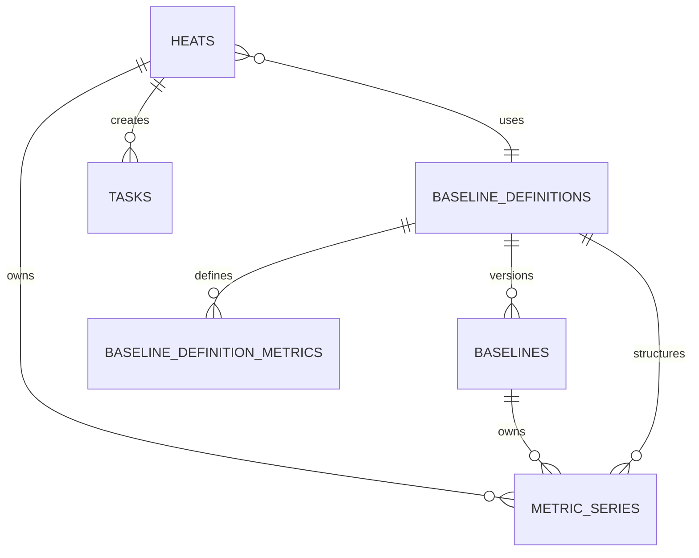

# 后端结构文档 (BACKEND_STRUCTURE)

## 1. 项目结构

```
apps/server/
├── src/
│   ├── main.py              # 应用入口
│   ├── config.py            # 配置管理
│   ├── database.py          # 数据库连接
│   │
│   ├── api/                  # API 路由
│   │   ├── __init__.py
│   │   ├── router.py         # 路由汇总
│   │   ├── baselines.py      # 基线 API
│   │   ├── heats.py          # 炉次 API
│   │   ├── tasks.py          # 任务 API
│   │   ├── reports.py        # 报表 API
│   │   └── settings.py       # 设置 API
│   │
│   ├── models/               # 数据模型 (SQLAlchemy)
│   │   ├── __init__.py
│   │   ├── baseline.py
│   │   ├── heat.py
│   │   ├── task.py
│   │   └── setting.py
│   │
│   ├── schemas/              # 数据模式 (Pydantic)
│   │   ├── __init__.py
│   │   ├── baseline.py
│   │   ├── heat.py
│   │   ├── task.py
│   │   └── common.py
│   │
│   ├── services/             # 业务逻辑
│   │   ├── __init__.py
│   │   ├── baseline_service.py
│   │   ├── deviation_service.py
│   │   ├── report_service.py
│   │   └── edc_client.py     # EDC API 客户端
│   │
│   └── utils/                # 工具函数
│       ├── __init__.py
│       └── pdf_generator.py
│
├── tests/                    # 测试
│   ├── conftest.py
│   ├── test_baselines.py
│   └── test_heats.py
│
├── alembic/                  # 数据库迁移
│   ├── versions/
│   └── env.py
│
├── pyproject.toml
└── alembic.ini
```

## 2. 数据模型

### 2.1 设计总览

本轮表结构按两类主表组织：

- 主数据主表：`baseline_definitions`
- 业务主表：`heats`

其余表全部作为外部表或从表存在：

- `baseline_definition_metrics`：定义下的指标模板
- `baselines`：定义下的基线版本
- `metric_series`：基线或炉次的实际指标值
- `tasks`：业务任务
- `settings`：系统设置

关键约束：

- 除“当前正在发生的炉次”外，其余炉次都应进入 `heats`
- 历史炉次的指标值统一存入 `metric_series`
- 基线版本不再把功率、电压等固定指标写死在主表字段里
- `baseline_definition_metrics.item` 与 `metric_series.item` 表示“指标项号”
- `baselines.item` 表示“版本号项”
- 当前炉次运行态缓存应尽量与 `heats + metric_series` 同构，避免再做一套单独字段语义
- 历史炉次的指标值允许保留“前 30 分钟 + 当前炉次区间 + 后 30 分钟”的上下文窗口，便于后续单炉次人工调整
- 所有未确认的自动回退、自动补全、自动替换都不应进入正式业务链路

时间语义约束：

- 所有绝对时间统一存 `timestamp(ms)`，数据库字段使用整数毫秒值，不再使用 SQLite `DateTime` 作为业务真源
- 所有 API 输入输出统一传 `timestamp(ms)`，前端不再提交或依赖无时区 ISO 字符串
- 业务日期、整天范围、班次、日报分组、基线生效匹配等“本地时间语义”统一按 `settings.plant_timezone` 解释
- `plant_timezone` 默认值为 `Asia/Shanghai`

### 2.2 `baseline_definitions`

主数据主表。

| Index | 字段 | 类型 | 主键 | 必填 | 用途 |
|---|---|---:|---:|---:|---|
| 1 | `id` | `string(36)` | 是 | 是 | 基线定义 ID |
| 2 | `definition_name` | `string(100)` | 否 | 是 | 基线定义名称 |
| 3 | `description` | `text` | 否 | 否 | 基线定义说明 |
| 4 | `expected_duration_minutes` | `int` | 否 | 是 | 预期炉次时长 |
| 5 | `status` | `string(20)` | 否 | 是 | 定义状态，控制该定义是否还能继续创建新基线 |
| 6 | `created_by` | `string(50)` | 否 | 是 | 创建人 |
| 7 | `updated_by` | `string(50)` | 否 | 是 | 更新人 |
| 8 | `created_at` | `int64(timestamp_ms)` | 否 | 是 | 创建时间 |
| 9 | `updated_at` | `int64(timestamp_ms)` | 否 | 是 | 更新时间 |

样例：

```json
{
  "id": "def-std-melt",
  "definition_name": "标准熔炼基线",
  "description": "中频炉标准熔炼过程",
  "expected_duration_minutes": 30,
  "status": "active",
  "created_by": "wang",
  "updated_by": "wang",
  "created_at": 1775218200000,
  "updated_at": 1775218200000
}
```

### 2.3 `baseline_definition_metrics`

定义指标模板表。  
复合主键：

- `definition_id`
- `item`

这里的 `item` 表示指标项号，例如 `001 / 002 / 003`。

| Index | 字段 | 类型 | 主键 | 必填 | 用途 |
|---|---|---:|---:|---:|---|
| 1 | `definition_id` | `string(36)` | 是 | 是 | 所属基线定义 ID |
| 2 | `item` | `string(3)` | 是 | 是 | 指标项号，如 `001 / 002 / 003` |
| 3 | `item_kind` | `string(20)` | 否 | 是 | 固定写 `metric_item`，显式说明这里的 `item` 是指标项号 |
| 4 | `metric_key` | `string(50)` | 否 | 是 | 指标业务键 |
| 5 | `metric_name` | `string(100)` | 否 | 是 | 指标名称 |
| 6 | `unit` | `string(20)` | 否 | 否 | 单位 |
| 7 | `color` | `string(20)` | 否 | 是 | 图表颜色 |
| 8 | `sort_order` | `int` | 否 | 是 | 展示顺序 |
| 9 | `edc_channel_id` | `string(100)` | 否 | 否 | 当前绑定通道 ID |
| 10 | `source_channel_name` | `string(100)` | 否 | 否 | 通道名称快照 |
| 11 | `source_channel_label` | `string(255)` | 否 | 否 | 通道显示标签快照 |
| 12 | `enabled` | `bool` | 否 | 是 | 是否启用 |
| 13 | `created_at` | `int64(timestamp_ms)` | 否 | 是 | 创建时间 |
| 14 | `updated_at` | `int64(timestamp_ms)` | 否 | 是 | 更新时间 |

样例：

```json
[
  {
    "definition_id": "def-std-melt",
    "item": "001",
    "item_kind": "metric_item",
    "metric_key": "power",
    "metric_name": "总有功功率",
    "unit": "kW",
    "color": "#409EFF",
    "sort_order": 1,
    "edc_channel_id": "2752-01",
    "source_channel_name": "總有功功率",
    "source_channel_label": "A01 / 總有功功率 / kW",
    "enabled": true
  },
  {
    "definition_id": "def-std-melt",
    "item": "002",
    "item_kind": "metric_item",
    "metric_key": "voltage_a",
    "metric_name": "A相电压",
    "unit": "V",
    "color": "#67C23A",
    "sort_order": 2,
    "edc_channel_id": "2752-02",
    "source_channel_name": "A相電壓",
    "source_channel_label": "A01 / A相電壓 / V",
    "enabled": true
  }
]
```

### 2.4 `baselines`

基线版本表。  
复合主键：

- `definition_id`
- `item`

这里的 `item` 表示版本号项，例如 `001 / 002 / 003`。

| Index | 字段 | 类型 | 主键 | 必填 | 用途 |
|---|---|---:|---:|---:|---|
| 1 | `definition_id` | `string(36)` | 是 | 是 | 所属基线定义 ID |
| 2 | `item` | `string(3)` | 是 | 是 | 基线版本项，如 `001 / 002 / 003` |
| 3 | `item_kind` | `string(20)` | 否 | 是 | 固定写 `baseline_version`，显式说明这里的 `item` 是版本号 |
| 4 | `name` | `string(100)` | 否 | 是 | 基线名称 |
| 5 | `description` | `text` | 否 | 否 | 基线描述 |
| 6 | `status` | `string(20)` | 否 | 否 | 基线状态，允许为空 |
| 7 | `source_heat_id` | `string(36)` | 否 | 是 | 生成该基线的来源炉次 |
| 8 | `selected_start_time` | `int64(timestamp_ms)` | 否 | 是 | 选区开始时间 |
| 9 | `selected_end_time` | `int64(timestamp_ms)` | 否 | 是 | 选区结束时间 |
| 10 | `effective_from` | `int64(timestamp_ms)` | 否 | 是 | 生效时间 |
| 11 | `tolerance_percent` | `float` | 否 | 是 | 容许误差百分比 |
| 12 | `created_by` | `string(50)` | 否 | 是 | 创建人 |
| 13 | `updated_by` | `string(50)` | 否 | 是 | 更新人 |
| 14 | `created_at` | `int64(timestamp_ms)` | 否 | 是 | 创建时间 |
| 15 | `updated_at` | `int64(timestamp_ms)` | 否 | 是 | 更新时间 |
| 16 | `published_at` | `int64(timestamp_ms)` | 否 | 否 | 发布时间 |

样例：

```json
{
  "definition_id": "def-std-melt",
  "item": "001",
  "item_kind": "baseline_version",
  "name": "标准基线 v1",
  "description": "2026-04 第一版",
  "status": "published",
  "source_heat_id": "heat-1740",
  "selected_start_time": 1775218800000,
  "selected_end_time": 1775220540000,
  "effective_from": 1775222160000,
  "tolerance_percent": 15.0,
  "created_by": "wang",
  "updated_by": "wang",
  "created_at": 1775222160000,
  "updated_at": 1775222160000,
  "published_at": 1775222220000
}
```

### 2.5 `metric_series`

指标值表。  
用于同时存：

- 基线版本里的指标值
- 炉次里的指标值

复合主键：

- `owner_key`
- `item`

| Index | 字段 | 类型 | 主键 | 必填 | 用途 |
|---|---|---:|---:|---:|---|
| 1 | `owner_key` | `string(80)` | 是 | 是 | 关联键；基线时指向 `{definition_id}:{baseline_item}`，炉次时指向 `heat_id` |
| 2 | `item` | `string(3)` | 是 | 是 | 指标项号，对应定义指标项 `001 / 002 / 003` |
| 3 | `owner_type` | `string(20)` | 否 | 是 | 所属对象类型，`baseline / heat` |
| 4 | `definition_id` | `string(36)` | 否 | 否 | 所属基线定义 ID |
| 5 | `item_kind` | `string(20)` | 否 | 是 | 固定写 `metric_item`，说明这里的 `item` 是指标项号 |
| 6 | `metric_key` | `string(50)` | 否 | 是 | 指标业务键 |
| 7 | `metric_name` | `string(100)` | 否 | 是 | 指标名称 |
| 8 | `unit` | `string(20)` | 否 | 否 | 单位，可空 |
| 9 | `color` | `string(20)` | 否 | 是 | 指标颜色 |
| 10 | `sort_order` | `int` | 否 | 是 | 展示顺序 |
| 11 | `source_channel_id` | `string(100)` | 否 | 否 | 通道 ID 快照 |
| 12 | `source_channel_name` | `string(100)` | 否 | 否 | 通道名称快照 |
| 13 | `source_channel_label` | `string(255)` | 否 | 否 | 通道标签快照 |
| 14 | `series_json` | `text` | 否 | 是 | 指标完整窗口数据 JSON，包含前 30 分钟 + 当前炉次区间 + 后 30 分钟 |
| 15 | `stat_json` | `text` | 否 | 否 | 统计信息 JSON |
| 16 | `created_at` | `int64(timestamp_ms)` | 否 | 是 | 创建时间 |
| 17 | `updated_at` | `int64(timestamp_ms)` | 否 | 是 | 更新时间 |

样例（基线）：

```json
{
  "owner_key": "def-std-melt:001",
  "item": "001",
  "owner_type": "baseline",
  "definition_id": "def-std-melt",
  "item_kind": "metric_item",
  "metric_key": "power",
  "metric_name": "总有功功率",
  "unit": "kW",
  "color": "#409EFF",
  "sort_order": 1,
  "source_channel_id": "2752-01",
  "source_channel_name": "總有功功率",
  "source_channel_label": "A01 / 總有功功率 / kW",
  "series_json": [
    { "timestamp": 1775218800000, "value": 420.2 },
    { "timestamp": 1775218860000, "value": 422.5 }
  ]
}
```

样例（炉次）：

```json
{
  "owner_key": "heat-20260403-1740",
  "item": "001",
  "owner_type": "heat",
  "definition_id": "def-std-melt",
  "item_kind": "metric_item",
  "metric_key": "power",
  "metric_name": "总有功功率",
  "unit": "kW",
  "color": "#409EFF",
  "sort_order": 1,
  "source_channel_id": "2752-01",
  "source_channel_name": "總有功功率",
  "source_channel_label": "A01 / 總有功功率 / kW",
  "series_json": {
    "context_start_time": 1775217000000,
    "heat_start_time": 1775218800000,
    "heat_end_time": 1775220540000,
    "context_end_time": 1775222340000,
    "points": [
      { "timestamp": 1775217000000, "value": 32.1 },
      { "timestamp": 1775217060000, "value": 31.8 },
      { "timestamp": 1775218800000, "value": 430.1 },
      { "timestamp": 1775218860000, "value": 436.8 },
      { "timestamp": 1775220540000, "value": 28.6 },
      { "timestamp": 1775220600000, "value": 27.9 }
    ]
  },
  "stat_json": {
    "context_min": 27.9,
    "context_max": 449.2,
    "heat_min": 401.3,
    "heat_max": 449.2,
    "heat_avg": 426.4
  }
}
```

### 2.6 `heats`

业务主表。  
除“当前正在发生的炉次”外，其余炉次都应进入这张表。  
本表除炉次真实起止时间外，还保留编辑/回看所需的上下文窗口时间。

| Index | 字段 | 类型 | 主键 | 必填 | 用途 |
|---|---|---:|---:|---:|---|
| 1 | `id` | `string(36)` | 是 | 是 | 炉次 ID |
| 2 | `heat_no` | `string(50)` | 否 | 是 | 炉次编号 |
| 3 | `description` | `text` | 否 | 否 | 炉次备注 |
| 4 | `furnace_id` | `string(50)` | 否 | 否 | 炉号/设备 ID |
| 5 | `start_time` | `int64(timestamp_ms)` | 否 | 是 | 开始时间 |
| 6 | `end_time` | `int64(timestamp_ms)` | 否 | 是 | 结束时间 |
| 7 | `context_start_time` | `int64(timestamp_ms)` | 否 | 是 | 上下文窗口开始时间，通常为真实开始前 30 分钟 |
| 8 | `context_end_time` | `int64(timestamp_ms)` | 否 | 是 | 上下文窗口结束时间，通常为真实结束后 30 分钟 |
| 9 | `sealed_at` | `int64(timestamp_ms)` | 否 | 是 | 固化入库时间 |
| 10 | `source_kind` | `string(30)` | 否 | 是 | 来源类型 |
| 11 | `baseline_definition_id` | `string(36)` | 否 | 否 | 绑定的基线定义 ID |
| 12 | `baseline_item` | `string(3)` | 否 | 否 | 绑定的基线版本项 |
| 13 | `baseline_effective_from_snapshot` | `int64(timestamp_ms)` | 否 | 否 | 绑定时的基线生效时间快照 |
| 14 | `deviation_status` | `string(20)` | 否 | 是 | 偏离度状态 |
| 15 | `deviation_percent` | `float` | 否 | 否 | 最大偏离度 |
| 16 | `avg_deviation_percent` | `float` | 否 | 否 | 平均偏离度 |
| 17 | `deviation_details_json` | `text` | 否 | 否 | 偏离详情 JSON |
| 18 | `time_offset_percent` | `float` | 否 | 否 | 时间偏移比例 |
| 19 | `mismatch_duration_minutes` | `float` | 否 | 否 | 连续不一致时长 |
| 20 | `cut_reason` | `string(100)` | 否 | 否 | 切割原因 |
| 21 | `cut_status` | `string(30)` | 否 | 是 | 切割状态 |
| 22 | `status` | `string(20)` | 否 | 是 | 炉次状态 |
| 23 | `created_by` | `string(50)` | 否 | 否 | 创建人 |
| 24 | `updated_by` | `string(50)` | 否 | 否 | 更新人 |
| 25 | `created_at` | `int64(timestamp_ms)` | 否 | 是 | 创建时间 |
| 26 | `updated_at` | `int64(timestamp_ms)` | 否 | 是 | 更新时间 |

样例：

```json
{
  "id": "heat-20260403-1740",
  "heat_no": "H20260403-1740",
  "furnace_id": "Furnace-A01",
  "start_time": 1775218800000,
  "end_time": 1775220540000,
  "context_start_time": 1775217000000,
  "context_end_time": 1775222340000,
  "sealed_at": 1775220720000,
  "source_kind": "live_inferred",
  "baseline_definition_id": "def-std-melt",
  "baseline_item": "001",
  "baseline_effective_from_snapshot": 1775222160000,
  "deviation_status": "ready",
  "deviation_percent": 12.8,
  "avg_deviation_percent": 7.3,
  "status": "normal"
}
```

### 2.7 `tasks`

| Index | 字段 | 类型 | 主键 | 必填 | 用途 |
|---|---|---:|---:|---:|---|
| 1 | `id` | `string(36)` | 是 | 是 | 任务 ID |
| 2 | `task_no` | `string(50)` | 否 | 是 | 任务编号 |
| 3 | `heat_id` | `string(36)` | 否 | 是 | 对应炉次 ID |
| 4 | `baseline_definition_id_snapshot` | `string(36)` | 否 | 否 | 任务创建时基线定义快照 |
| 5 | `baseline_item_snapshot` | `string(3)` | 否 | 否 | 任务创建时基线版本项快照 |
| 6 | `deviation_percent` | `float` | 否 | 是 | 偏离度快照 |
| 7 | `deviation_snapshot_json` | `text` | 否 | 是 | 偏离详情快照 |
| 8 | `cause_analysis` | `text` | 否 | 否 | 原因分析 |
| 9 | `improvement` | `text` | 否 | 否 | 改善措施 |
| 10 | `prevention` | `text` | 否 | 否 | 预防措施 |
| 11 | `status` | `string(20)` | 否 | 是 | 任务状态 |
| 12 | `created_at` | `int64(timestamp_ms)` | 否 | 是 | 创建时间 |
| 13 | `updated_at` | `int64(timestamp_ms)` | 否 | 是 | 更新时间 |
| 14 | `completed_at` | `int64(timestamp_ms)` | 否 | 否 | 完成时间 |

### 2.8 `settings`

只存系统设置，不再承担主业务历史台账。

| Index | 字段 | 类型 | 主键 | 必填 | 用途 |
|---|---|---:|---:|---:|---|
| 1 | `key` | `string(100)` | 是 | 是 | 设置项键 |
| 2 | `value` | `text` | 否 | 是 | 设置值 |
| 3 | `description` | `string(255)` | 否 | 否 | 设置说明 |
| 4 | `updated_at` | `int64(timestamp_ms)` | 否 | 是 | 更新时间 |

关键设置项：

- `plant_timezone`: 工厂业务时区，默认 `Asia/Shanghai`
- `work_start_time / work_end_time / break_periods`: 作为 `plant_timezone` 下的本地时间规则解释

### 2.9 表关系



业务口径：

- `baseline_definitions` 是主数据根
- `heats` 是业务根
- `baseline_definition_metrics` 定义每个主数据下有哪些指标项
- `baselines` 定义每个主数据下有哪些基线版本
- `metric_series` 真正存放基线或炉次的指标值
- `tasks` 绑定业务炉次产生后续纠偏闭环

### 2.11 当前炉次运行态缓存设计

当前炉次运行态不再单独设计一套与正式表完全不同的字段语义；应尽量与 `heats + metric_series` 同构。

推荐口径：

- 当前炉次缓存对象保留与 `heats` 相同的关键字段：
  - `id / heat_no / start_time / end_time`
  - `context_start_time / context_end_time`
  - `baseline_definition_id / baseline_item`
  - `deviation_status`
- 当前炉次指标值缓存保留与 `metric_series` 相同的结构：
  - `owner_key`
  - `item`
  - `metric_key / metric_name / unit`
  - `series_json`
  - `stat_json`
- 运行态只额外补少量缓存语义字段，例如：
  - `record_stage=runtime`
  - `last_point_at`
  - `runtime_status`

这样做的目的：

- 入库时尽量不做结构转换
- 调试和测试时缓存态/正式态断言尽量一致
- 避免再维护一套“运行态字段”与一套“正式表字段”

### 2.10 建议索引

`baseline_definitions`

- `PRIMARY KEY (id)`
- `INDEX idx_baseline_definitions_status (status)`
- `INDEX idx_baseline_definitions_name (definition_name)`

`baseline_definition_metrics`

- `PRIMARY KEY (definition_id, item)`
- `INDEX idx_definition_metrics_metric_key (metric_key)`
- `INDEX idx_definition_metrics_sort (definition_id, sort_order)`
- `INDEX idx_definition_metrics_channel (edc_channel_id)`

`baselines`

- `PRIMARY KEY (definition_id, item)`
- `INDEX idx_baselines_effective_from (effective_from)`
- `INDEX idx_baselines_status (status)`
- `INDEX idx_baselines_source_heat (source_heat_id)`
- `INDEX idx_baselines_definition_published (definition_id, status, published_at)`

`metric_series`

- `PRIMARY KEY (owner_key, item)`
- `INDEX idx_metric_series_owner_type (owner_type, owner_key)`
- `INDEX idx_metric_series_definition (definition_id)`
- `INDEX idx_metric_series_metric_key (metric_key)`

`heats`

- `PRIMARY KEY (id)`
- `UNIQUE INDEX uq_heats_heat_no (heat_no)`
- `INDEX idx_heats_start_time (start_time DESC)`
- `INDEX idx_heats_end_time (end_time DESC)`
- `INDEX idx_heats_furnace_time (furnace_id, start_time DESC)`
- `INDEX idx_heats_baseline_binding (baseline_definition_id, baseline_item, start_time DESC)`
- `INDEX idx_heats_status (status, start_time DESC)`
- `INDEX idx_heats_deviation_status (deviation_status, start_time DESC)`

`tasks`

- `PRIMARY KEY (id)`
- `UNIQUE INDEX uq_tasks_task_no (task_no)`
- `INDEX idx_tasks_heat (heat_id, created_at DESC)`
- `INDEX idx_tasks_status (status, created_at DESC)`

`settings`

- `PRIMARY KEY (key)`

## 3. API 设计

## 3. API 设计

### 3.1 基线 API

| 方法 | 路径 | 说明 |
|------|------|------|
| GET | /api/baselines | 获取基线列表 |
| GET | /api/baselines/{id} | 获取基线详情 |
| POST | /api/baselines | 创建基线 |
| PATCH | /api/baselines/{id} | 更新基线 |
| POST | /api/baselines/{id}/publish | 发布基线 |
| POST | /api/baselines/{id}/disable | 停用基线 |
| DELETE | /api/baselines/{id} | 删除基线（仅草稿） |

### 3.2 炉次 API

| 方法 | 路径 | 说明 |
|------|------|------|
| GET | /api/heats | 获取炉次列表 |
| GET | /api/heats/{id} | 获取炉次详情 |
| GET | /api/heats/{id}/curve | 获取炉次曲线数据 |
| GET | /api/heats/{id}/compare | 获取与基线对比数据 |
| POST | /api/heats/{id}/analyze | 触发偏差分析 |

### 3.3 任务 API

| 方法 | 路径 | 说明 |
|------|------|------|
| GET | /api/tasks | 获取任务列表 |
| GET | /api/tasks/{id} | 获取任务详情 |
| POST | /api/tasks | 创建任务 |
| PATCH | /api/tasks/{id} | 更新任务 |
| POST | /api/tasks/{id}/complete | 完成任务 |
| GET | /api/tasks/{id}/pdf | 导出任务 PDF |

### 3.4 报表 API

| 方法 | 路径 | 说明 |
|------|------|------|
| GET | /api/reports/daily | 获取日报列表 |
| GET | /api/reports/daily/{date} | 获取指定日期日报 |
| GET | /api/reports/daily/{date}/pdf | 导出日报 PDF |
| POST | /api/reports/daily/{date}/generate | 手动生成日报 |

### 3.5 设置 API

| 方法 | 路径 | 说明 |
|------|------|------|
| GET | /api/settings | 获取所有设置 |
| PATCH | /api/settings | 批量更新设置 |

### 3.6 仪表盘 API

| 方法 | 路径 | 说明 |
|------|------|------|
| GET | /api/dashboard/stats | 获取统计数据 |
| GET | /api/dashboard/realtime | 获取实时曲线数据 |
| GET | /api/dashboard/recent-heats | 获取最近炉次 |

### 3.7 炉次运行态与历史台账分层约束

自 `2026-04-03` 起，炉次读模型应遵守以下约束：

- `active_runtime`：仅代表当前炉次，可变
- `previous_runtime`：仅代表前一个炉次，可短暂待收口，可变
- `sealed_history`：其余全部为固化历史，不可再被实时重切覆盖

实现约束：

- `/api/heats` 可以把三类记录合并返回，但必须保持语义分明
- 历史炉次一旦进入 `sealed_history`，其 `id / heat_no / start_time / end_time` 不应再变化
- 详情接口必须优先保证历史稳定可读，不能因运行态重算导致旧列表记录第一次点击直接 404
- 若运行态 ID 在切割边界变化后失效，后端应通过 alias 或等效映射把旧 ID 解析到当前有效记录

### 3.8 API 读写映射

`baseline_definitions`

- 读：
  - `GET /api/baseline-definitions`
  - `GET /api/baseline-definitions/{id}`
- 写：
  - `POST /api/baseline-definitions`
  - `PATCH /api/baseline-definitions/{id}`
  - `DELETE /api/baseline-definitions/{id}`

`baseline_definition_metrics`

- 读：
  - `GET /api/baseline-definitions/{id}`
  - `GET /api/baseline-definitions/{id}/metrics`
- 写：
  - `POST /api/baseline-definitions/{id}/metrics`
  - `PATCH /api/baseline-definitions/{id}/metrics/{item}`
  - `DELETE /api/baseline-definitions/{id}/metrics/{item}`

`baselines`

- 读：
  - `GET /api/baselines`
  - `GET /api/baselines/{definition_id}/{item}`
- 写：
  - `POST /api/baselines`
  - `PATCH /api/baselines/{definition_id}/{item}`
  - `POST /api/baselines/{definition_id}/{item}/publish`
  - `POST /api/baselines/{definition_id}/{item}/disable`

`metric_series`

- 读：
  - `GET /api/baselines/{definition_id}/{item}/series`
  - `GET /api/heats/{heat_id}/series`
  - `GET /api/heats/{heat_id}/compare`
- 写：
  - 基线创建/发布时由后端批量写入
  - 炉次固化时由后端批量写入
  - 人工修订炉次后由后台批量重算写入

`heats`

- 读：
  - `GET /api/heats`
  - `GET /api/heats/{id}`
  - `GET /api/heats/{id}/compare`
  - `GET /api/heats/{id}/cutting-timeline`
- 写：
  - 当前炉次结束后入库
  - 历史修订任务完成后更新

`tasks`

- 读：
  - `GET /api/tasks`
  - `GET /api/tasks/{id}`
- 写：
  - `POST /api/tasks`
  - `PATCH /api/tasks/{id}`
  - `POST /api/tasks/{id}/complete`

### 3.9 从当前 runtime JSON 迁移到新表结构的步骤表

| 步骤 | 动作 | 来源 | 目标 | 备注 |
|---|---|---|---|---|
| 1 | 冻结旧 `runtime_*` 作为迁移输入 | `settings.runtime_*` | 迁移脚本内存对象 | 迁移窗口内禁止并发结构性写入 |
| 2 | 迁移基线定义主记录 | `runtime_baseline_definitions` | `baseline_definitions` | 先生成定义主键与审计字段 |
| 3 | 迁移定义指标项 | `runtime_baseline_definitions[*].metrics` | `baseline_definition_metrics` | 为每条指标生成 `item=001/002/003` |
| 4 | 迁移基线版本主记录 | `runtime_baselines` | `baselines` | 为每个定义下版本生成版本项 `item=001/002/003` |
| 5 | 迁移基线指标值 | `runtime_baselines[*].curves` 等 | `metric_series` | `owner_type=baseline`，`owner_key={definition_id}:{baseline_item}` |
| 6 | 迁移历史炉次主记录 | `runtime_heats` | `heats` | 仅迁移已结束炉次；当前活跃炉次不直接入库 |
| 7 | 迁移历史炉次指标值 | `runtime_heats[*].curves` | `metric_series` | `owner_type=heat`，`owner_key=heat_id` |
| 8 | 迁移任务 | `runtime_tasks` | `tasks` | 保留任务快照与状态 |
| 9 | 保留运行态只服务当前炉次 | `runtime_active_heat_runtime` | 内存运行态 | 不再作为历史主读链路 |
| 10 | 切换 API 主读链路 | 旧 `runtime_*` | 正式表 | 列表、详情、比对优先读正式表 |
| 11 | 迁移完成后将旧 `runtime_*` 降级为兼容态 | `settings` | 仅过渡兼容 | 后续版本再彻底移除 |

## 4. Pydantic 模式

### 4.1 基线模式

```python
# schemas/baseline.py
from pydantic import BaseModel, Field
from datetime import datetime
from typing import Optional, List

class CurvePoint(BaseModel):
    timestamp: datetime
    value: float

class BaselineCreate(BaseModel):
    name: str = Field(..., min_length=1, max_length=100)
    description: Optional[str] = None
    source_heat_id: str
    tolerance_percent: float = Field(default=15.0, ge=0, le=100)

class BaselineUpdate(BaseModel):
    name: Optional[str] = Field(None, min_length=1, max_length=100)
    description: Optional[str] = None
    tolerance_percent: Optional[float] = Field(None, ge=0, le=100)

class BaselineResponse(BaseModel):
    id: str
    name: str
    description: Optional[str]
    source_heat_id: str
    tolerance_percent: float
    status: str
    version: int
    created_at: datetime
    updated_at: datetime
    published_at: Optional[datetime]

    class Config:
        from_attributes = True

class BaselineWithCurve(BaselineResponse):
    power_curve: List[CurvePoint]
    voltage_curve: List[CurvePoint]
    temperature: Optional[float]
```

## 5. 服务层

### 5.1 偏差计算服务

```python
# services/deviation_service.py
from typing import List, Tuple
import numpy as np

class DeviationService:
    def calculate_deviation(
        self,
        baseline_curve: List[Tuple[float, float]],
        current_curve: List[Tuple[float, float]],
        tolerance: float
    ) -> dict:
        """
        计算偏差百分比和异常区间
        
        Returns:
            {
                "max_deviation": float,
                "avg_deviation": float,
                "abnormal_ranges": [
                    {"start": timestamp, "end": timestamp, "deviation": float}
                ],
                "status": "normal" | "abnormal"
            }
        """
        # 对齐时间轴
        aligned_baseline, aligned_current = self._align_curves(
            baseline_curve, current_curve
        )
        
        # 计算偏差
        deviations = []
        for (t, b), (_, c) in zip(aligned_baseline, aligned_current):
            if b != 0:
                dev = abs(c - b) / b * 100
            else:
                dev = 0 if c == 0 else 100
            deviations.append((t, dev))
        
        # 识别异常区间
        abnormal_ranges = self._find_abnormal_ranges(deviations, tolerance)
        
        max_dev = max(d[1] for d in deviations)
        avg_dev = sum(d[1] for d in deviations) / len(deviations)
        
        return {
            "max_deviation": max_dev,
            "avg_deviation": avg_dev,
            "abnormal_ranges": abnormal_ranges,
            "status": "abnormal" if max_dev > tolerance else "normal"
        }
```

### 5.2 EDC 客户端

```python
# services/edc_client.py
import httpx
from typing import List, Tuple
from datetime import datetime

class EDCClient:
    def __init__(self, base_url: str, api_key: str):
        self.base_url = base_url
        self.api_key = api_key
        self.client = httpx.AsyncClient(
            base_url=base_url,
            headers={"Authorization": f"Bearer {api_key}"},
            timeout=30.0
        )
    
    async def get_realtime_data(
        self,
        channel_ids: List[str],
        duration_seconds: int = 300
    ) -> dict:
        """获取实时数据（最近 N 秒）"""
        response = await self.client.get(
            "/api/realtime",
            params={
                "channels": ",".join(channel_ids),
                "duration": duration_seconds
            }
        )
        response.raise_for_status()
        return response.json()
    
    async def get_history_data(
        self,
        channel_ids: List[str],
        start_time: datetime,
        end_time: datetime
    ) -> dict:
        """获取历史数据"""
        response = await self.client.get(
            "/api/history",
            params={
                "channels": ",".join(channel_ids),
                "start": start_time.isoformat(),
                "end": end_time.isoformat()
            }
        )
        response.raise_for_status()
        return response.json()
```

备注：EDC 接口路径需与 `material/EDC AI通信基座API使用說明書.docx` 核对后再最终定稿。

## 6. 配置管理

```python
# config.py
from pydantic_settings import BaseSettings
from typing import Optional

class Settings(BaseSettings):
    # 应用配置
    app_name: str = "ASNS AI老师傅系统"
    debug: bool = False
    
    # 数据库
    database_url: str = "sqlite+aiosqlite:///./data/asns.db"
    
    # EDC API
    edc_base_url: str = "http://localhost:8080"
    edc_api_key: Optional[str] = None
    
    # 默认参数
    default_tolerance_percent: float = 15.0
    
    # 报表
    report_generation_hour: int = 2  # 凌晨 2 点生成日报
    
    class Config:
        env_file = ".env"
        env_prefix = "ASNS_"

settings = Settings()
```

## 7. 禁止事项

| 禁止 | 原因 | 替代方案 |
|------|------|----------|
| 同步数据库操作 | 阻塞事件循环 | 使用 async/await |
| 硬编码配置 | 难以部署 | 使用环境变量 |
| `# type: ignore` | 隐藏类型错误 | 修复类型问题 |
| 裸 `except:` | 隐藏错误 | 捕获具体异常 |
| SQL 字符串拼接 | SQL 注入 | 使用 ORM 或参数化 |
| 直接返回 ORM 对象 | 序列化问题 | 使用 Pydantic 模式 |
