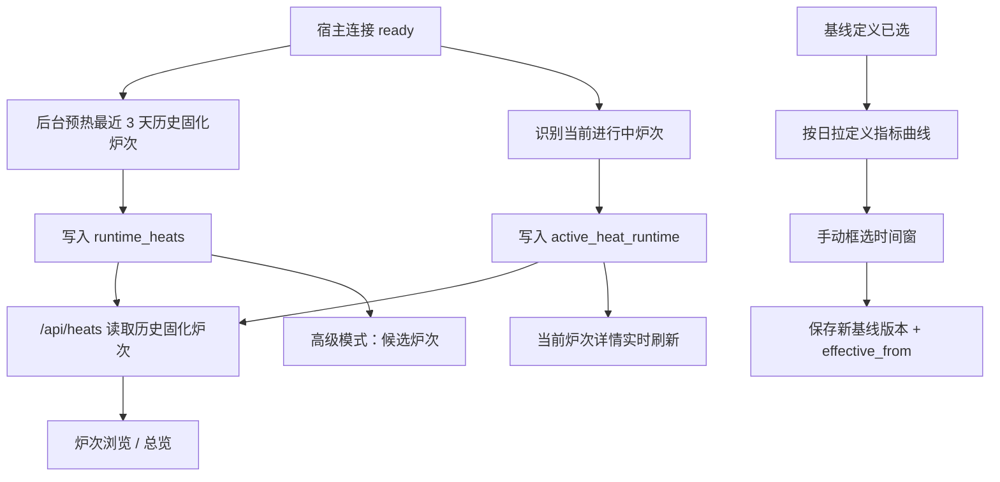

# 炉次运行态缓存与基线向导解耦方案

> 目标：把“炉次推断”从 UI 读请求路径里移走，改成后台准备好的运行态台账；同时让“新建基线”默认不再依赖 `/api/heats`，避免 UAT 阶段继续被慢接口卡住。

---

## 1. 结论先行

本次建议同时推进两件事：

1. 把 `/api/heats` 从“现算接口”改成“历史固化炉次 + 当前进行中炉次实时态”的组合接口
2. 把基线向导主路径改成“按日拉定义指标曲线 + 手动框选时间窗”

这两件事必须一起看，但不需要一起上线。

推荐落地顺序：

1. 先把炉次推断迁出请求路径，给炉次浏览和总览页止血
2. 再把基线向导主路径从 `/api/heats` 解耦
3. 最后把“候选炉次”降级为高级模式，而不是默认主路径

我的明确建议是：

- 默认方案走“后台固化历史炉次 + 前台读取历史 + 拼接当前实时炉次”
- 基线创建默认走“按日曲线框选”
- 不建议继续围绕 `page_size`、前端重试、接口 timeout 做局部修补

原因很简单：

- 现在慢点不在分页，而在 `/api/heats` 的请求路径里混入了实时推断
- 基线向导真正要解决的是“选一段稳定曲线作为基线”，不是“必须先切出炉次”
- 历史炉次和当前进行中的炉次，本来就不该用同一套“全量重算”语义处理

---

## 2. 当前问题

### 2.1 `/api/heats` 当前不是简单查表

当前真实链路是：

- `list_heats()` 先调用 `_list_heat_store()`
- `_list_heat_store()` 会直接调用 `_get_live_inferred_heat_store()`
- `_get_live_inferred_heat_store()` 会实时拉取宿主通道点位并推断整批炉次
- 列表接口随后还会继续 `_build_heat_list_views()`

这意味着：

- 炉次浏览打开时会触发实时推断
- 基线向导如果读候选炉次，也会触发实时推断
- UI 只是“看列表”，后端却在“算台账”

这不是接口偶发慢，而是职责放错层。

### 2.2 当前缓存只有“短 TTL 内存缓存”，没有“可复用运行态固化层”

当前 `_get_live_inferred_heat_store()` 已有短期 TTL 和 inflight 复用，但仍然属于请求期缓存。

问题在于：

- 进程重启后缓存失效
- 缓存没有按“天 / source / 上下文版本”沉淀成稳定固化结果
- UI 请求仍然可能成为首次触发者

这只能缓解重复请求，不能把重活从请求链路中移走。

### 2.3 基线向导在产品语义上也绑错了依赖

当前基线向导预览接口 `GET /api/baseline-definitions/{definition_id}/preview-curves?heat_id=...` 的流程是：

1. 先根据 `heat_id` 去解析炉次时间窗
2. 再按定义绑定通道拉一天曲线

这使得：

- “我要建基线”先变成“我要先找到一个炉次”
- 只要炉次推断慢，基线创建就跟着慢

但用户真正要做的是：

- 选择一组定义指标
- 看某天曲线
- 选一段稳定窗口
- 保存成基线

所以这里的默认依赖应该是“日曲线”，不是“炉次列表”。

---

## 3. 目标与非目标

### 3.1 本次目标

- `/api/heats` 不再在请求路径里实时推断整批炉次
- 历史炉次固化后不因新基线 / 新规则回改
- 当前进行中的炉次可以分钟级实时展示
- 基线版本只对 `effective_from` 之后的新业务数据生效
- 基线向导默认不依赖 `/api/heats`
- 保留现有炉次浏览能力，不废弃炉次概念
- 保持改造尽量小，不做跨模块大重写

### 3.2 非目标

- 不重写整套炉次推断算法
- 不把历史所有天数都做离线回灌
- 不引入新的数据库表结构
- 不一次性重做所有 compare / deviation 逻辑

这里要强调：

- “后台准备炉次台账”是一个可 boil 的 lake
- “把整个历史台账平台化重构”是 ocean，不应该在这轮做

---

## 4. 推荐目标态

### 4.1 状态分层

建议把炉次相关状态拆成四层：

#### A. 原始点位层

- 来源：EDC 宿主真实通道
- 内容：功率等原始时序点位
- 特征：真实、昂贵、拉取慢

#### B. 历史炉次固化层

- 来源：后台根据原始点位推断出的、已经完成的炉次切割结果
- 内容：`heat_id`、`heat_no`、`start_time`、`end_time`、状态、绑定的基线版本等
- 特征：可持久化、可增量刷新、历史固化后不回改

#### C. 当前炉次实时态

- 来源：当前仍在进行中的实时点位
- 内容：当前炉次开始时间、当前已采样曲线、当前绑定基线版本、实时状态
- 特征：分钟级刷新、不进入“历史固化不变”的语义

#### D. 页面视图层

- 来源：历史炉次固化层 + 当前炉次实时态 + 轻量补充信息
- 内容：分页、筛选、展示字段
- 特征：轻、快、读运行态

目标是：

- 重活停留在 A -> B
- 当前进行中炉次走 A -> C
- UI 请求只消费 B / C -> D

### 4.2 时间语义

这轮设计必须固定三条时间规则：

#### A. 历史数据固化

- 已完成炉次一旦进入历史固化层，就不因后续基线变更被重新切割或重新归属

#### B. 基线版本只影响未来

- 新建基线或修改基线时，必须带 `effective_from`
- 新版本只对 `effective_from` 之后开始的炉次生效
- `effective_from` 最早允许设为最近 3 天前，与缓存窗口对齐

#### C. 炉次按开始时刻绑定基线版本

- 某条炉次一旦开始，就绑定它开始时刻对应的生效基线版本
- 即使这条炉次尚未结束，后续再发布新基线，也不改变这条炉次已绑定的版本

### 4.3 基线向导状态分层

基线向导建议拆成两条路径：

#### 默认路径：按日曲线框选

- 选择基线定义
- 选择日期
- 点击“加载当天数据”
- 拉取定义绑定指标在当天 24 小时内的曲线
- 用户手动框选时间窗

#### 高级路径：从候选炉次带入

- 用户主动点“使用候选炉次”
- 再读取已经准备好的炉次台账
- 从某条炉次预填时间窗

这样做的意义是：

- 主路径最稳
- 炉次能力仍保留
- 智能能力从“阻塞前提”降级为“辅助增强”

---

## 5. 后端设计

### 5.1 运行态缓存策略

不建议缓存整个 `/api/heats` 响应。

建议缓存对象为：

- “历史固化炉次台账”
- “当前进行中炉次实时态”

建议复用当前运行态持久化机制，在 `settings` 表中继续存 JSON，不新增表结构。

推荐新增三个运行态 section：

- `runtime_heats`
- `runtime_heats_refresh_meta`
- `active_heat_runtime`

其中：

#### `runtime_heats`

保存历史固化炉次，键仍然是 `heat_id`，值尽量保留现有 heat record 结构，并补充：

- `baseline_version_id`
- `baseline_effective_from`
- `sealed_at`

#### `runtime_heats_refresh_meta`

建议保存以下元信息：

- `source_revision`
- `live_context_hash`
- `snapshot_range_start`
- `snapshot_range_end`
- `snapshot_watermark`
- `last_refresh_started_at`
- `last_refresh_completed_at`
- `refresh_status`
- `refresh_error`
- `coverage_days`

这个 meta 的目的不是给业务页面直接展示，而是让 `/api/heats` 知道：

- 历史固化台账已经可靠覆盖到哪个时间点
- 当前是否正在刷新
- 这份快照对应哪套 source / role binding / inference 参数

#### `active_heat_runtime`

保存当前进行中炉次的运行态，建议只保留单条或极少数活跃记录，内容包括：

- `heat_id`
- `start_time`
- `last_point_at`
- `status=in_progress`
- `baseline_version_id`
- `baseline_effective_from`
- `current_curves`
- `current_compare_summary`

### 5.2 刷新触发策略

建议采用“后台预热 + 事件失效 + 手动刷新”三类触发。

#### A. 启动预热

服务启动后，如果宿主连接已就绪且 `live_heat_inference` 角色完整：

- 异步预热最近 3 天历史固化炉次

不要阻塞应用启动。

#### B. 事件失效

以下事件发生后，标记历史固化台账需要刷新并触发后台刷新：

- source 切换
- `live_heat_inference` 角色绑定变化
- 炉次切割规则版本变化
- 宿主连接从 disconnected -> connected

这里要补一条关键业务规则：

- 规则版本变化默认只影响未来，不回改历史已固化炉次

也就是说：

- 如果用户把预期时长从 30 分钟改到 40 分钟
- 那么只影响 `effective_from` 之后开始的新炉次
- `runtime_heats` 中已固化的历史炉次不重切、不重写

这里的核心不是“立刻让当前用户等待刷新完成”，而是：

- 先保留已固化的历史炉次
- 后台异步刷新未来窗口内应按新规则接管的数据
- 当前进行中炉次按其开始时刻绑定的规则继续跑完

#### C. 手动刷新

建议新增显式刷新入口：

- `POST /api/heats/runtime/refresh`

用途：

- UAT 时人工触发
- 出现历史固化缺口时人工重算
- 排查宿主切换后的边界问题

手动刷新默认必须是异步任务，不阻塞当前请求。

推荐支持三级范围：

1. 默认刷新：只刷新最近 3 天历史窗口
2. 按范围刷新：只刷新指定日期或时间窗
3. 强制全量重建：仅管理员可用，不作为默认入口

### 5.3 热区与冷区

建议不要简单写“缓存 3 天”就结束，而是按热度分层：

#### 热区：当前进行中炉次 + 最近 12 小时

- 当前进行中炉次走 `active_heat_runtime`
- 最近刚完成、尚未固化完的炉次做高频增量刷新
- 主要覆盖仍可能变化或刚结束待封板的数据

#### 温区：1 到 3 天

- 只做较低频刷新
- 主要存放历史固化炉次
- 可在启动后、换源后、手动刷新时重建

#### 冷区：超过 3 天

- 不自动重算
- 如需补算，走人工刷新或管理入口

推荐默认覆盖最近 3 天，原因是：

- 足够覆盖 UAT 与近几天生产回看
- 数据量可控
- 不会把整个历史推断任务塞进当前改造

### 5.4 `/api/heats` 的新职责

`GET /api/heats` 改造成：

- 读取 `runtime_heats` 中的历史固化炉次
- 读取 `active_heat_runtime` 中的当前进行中炉次摘要
- 按统一视图排序、筛选、分页
- 仅做轻量视图拼装

不再允许它在请求路径里：

- 直接触发整批实时推断
- 直接成为首次计算触发点

推荐行为如下：

1. 有历史固化炉次：直接返回历史数据
2. 有当前进行中炉次：拼入一条 `in_progress` 记录
3. 历史固化刷新进行中：继续返回已固化历史 + 当前实时炉次，并标记 `snapshot_status=refreshing_history`
4. 当前 source 下首次启动且历史固化尚未准备好：返回 `warming`

这里的 `warming` 只代表：

- 当前 source 下第一份历史固化台账还没准备好

它不代表：

- 当前进行中炉次不能显示

也就是说，即使 `runtime_heats` 还在 warming，只要 `active_heat_runtime` 已识别出当前炉次，UI 仍应显示：

- 一条 `in_progress` 炉次
- 从炉次开始时刻到当前时刻的实时曲线

我的建议是：

- 不要在这里偷偷 fallback 到“整批实时推断”
- 但要允许列表与详情显式读取 `active_heat_runtime`

因为一旦把整批实时推断留在默认请求口里，后面所有页面又会重新把它当“可现算接口”。

### 5.5 `resolve_heat_record` 的职责收口

当前 `resolve_heat_record()` 会：

- 先查 `_HEAT_STORE`
- 找不到时再去 live inference store 里动态匹配

这会让很多非列表场景也隐式触发实时推断。

建议改成三层：

#### 默认历史模式

- 只读持久化历史炉次

#### 当前活跃模式

- 如果请求的 `heat_id` 属于当前进行中炉次，则读 `active_heat_runtime`

#### 管理 / 调试模式

- 允许手动 live fallback

也就是把“live fallback”从默认逻辑降级成显式能力，而不是隐式保底。

---

## 6. 基线向导设计

### 6.1 推荐的新主路径

基线向导改成三步：

1. 设置基线
2. 选择日期并加载曲线
3. 确认发布

第二步不再默认展示“候选炉次列表”，而是展示：

- 日期选择器
- “加载当天数据”按钮
- 指标曲线图
- 时间窗框选组件

### 6.2 新接口建议

建议新增：

- `GET /api/baseline-definitions/{definition_id}/day-curves?date=2026-04-01`

返回内容：

- `definition_id`
- `date`
- `range_start`
- `range_end`
- `curves_data`
- `curve_source`

这个接口只做一件事：

- 按当前定义绑定的指标，拉指定日期内的真实曲线

它不需要：

- 先知道 `heat_id`
- 先完成炉次切割

### 6.3 旧接口处置

当前接口：

- `GET /api/baseline-definitions/{definition_id}/preview-curves?heat_id=...`

建议保留，但调整定位为：

- 高级模式接口
- 仅在用户主动从候选炉次带入时使用

这样可以：

- 减少一次性删功能的风险
- 给 UAT 一个更稳的默认路径
- 后续如果炉次台账稳定，再决定是否继续保留

### 6.4 保存模型

基线保存时，继续保存当前基线已经需要的字段：

- `definition_id`
- `selected_start`
- `selected_end`
- `curves_data`
- 相关展示字段

但这里要补一条更关键的业务规则：

- 基线修改不覆盖旧版本
- 应创建新版本，并写入 `effective_from`
- 新版本只影响 `effective_from` 之后开始的炉次

但 `source_heat_id` 需要允许两种来源：

#### 来源 A：基于候选炉次创建

- `source_heat_id` 为真实炉次 ID

#### 来源 B：基于日曲线框选创建

- `source_heat_id` 允许为空或使用新的 `source_window_id`

我更推荐：

- 保留 `source_heat_id` 可空
- 新增 `source_window_label` 或 `source_window_day`
- 基线实体补 `effective_from`
- 炉次实体补 `baseline_version_id`

原因是：

- 按日框选并不天然对应某个稳定炉次 ID
- 强行回填 `source_heat_id` 只会重新把基线模型绑回炉次推断

这是本设计里唯一会碰到数据模型边界的点。

如果这一步想把 diff 控到最小，也可以临时采用：

- 草稿基线允许 `source_heat_id=""`
- 发布前只以 `selected_start` / `selected_end` 和曲线数据为准

### 6.5 当前炉次详情的展示规则

如果当前有一条进行中的炉次，例如：

- `10:20` 开始
- `10:25` 用户打开详情

那么详情页必须能同时展示：

- 当前炉次开始时刻绑定的黄金基线完整曲线
- 当前炉次 `10:20 -> 10:25` 已发生的实际曲线
- 仅基于已发生区间计算的动态偏差

它不应该等待：

- 历史固化刷新完成
- 最近 3 天台账全量重建完成

### 6.6 页面交互建议

默认第二步建议这样呈现：

1. 先展示定义里绑定的指标清单
2. 选择日期
3. 点“加载当天数据”
4. 图表加载后默认显示全天
5. 用户拖拽选择时间窗
6. 右侧面板显示：
   - 选择起止时间
   - 覆盖时长
   - 指标点数
   - 数据缺失提示

高级入口建议放在次级位置：

- `使用候选炉次带入时间窗`

不要反过来。

---

## 7. 数据结构与兼容策略

### 7.1 为什么优先复用 `runtime_heats`

当前运行态持久化已经有：

- `runtime_heats`

因此最小方案应该是：

- 继续把它作为“历史固化炉次”
- 补一份 refresh meta
- 新增 `active_heat_runtime` 表达当前进行中的实时炉次

不建议这轮上来就新建多张 heat cache 表。

### 7.2 兼容旧前端的策略

现有前端已经依赖：

- heat list item 的基础字段
- baseline compare 相关字段
- 详情页按 `heat_id` 读取数据

所以建议保持：

- 现有 heat record 主结构不变

本轮只增加：

- 历史固化 freshness 元信息
- 当前进行中炉次运行态
- 可选的后台刷新接口

### 7.3 对基线数据模型的兼容

如果本轮不想扩大 DB / schema 变更，可以采用分阶段方案：

#### 第一阶段

- 前端支持按日曲线框选
- 草稿基线允许 `source_heat_id` 为空字符串
- 展示时优先使用保存下来的 `selected_start` / `selected_end`
- 基线版本新增 `effective_from`

#### 第二阶段

- 再补充更明确的 `source_mode`
- 再补 `source_window_day`
- 再补更完整的基线版本链路展示

我倾向于先做第一阶段，先把可用性和时间语义救回来。

---

## 8. 测试图

测试应覆盖 5 组场景：

1. 首次启动历史固化未完成时，`/api/heats` 不触发同步整批推断，但当前进行中炉次仍可显示
2. 已有历史固化时，炉次列表和基线高级模式都只读历史固化数据
3. 当前进行中炉次详情可分钟级刷新，并展示“完整黄金基线 + 当前已发生曲线”
4. 新基线版本设置 `effective_from` 后，只影响之后开始的新炉次，不回改历史炉次
5. 基线向导默认路径不依赖 `/api/heats` 也能完成创建，且高级模式失败不影响默认路径

---

## 9. 风险与取舍

### 9.1 最大收益

- 直接切掉 UAT 当前最痛的慢点
- 炉次浏览、总览、基线创建三条链路一起变稳
- 运行态概念更清楚：历史固化在后台算，当前炉次实时读

### 9.2 主要风险

- `source_heat_id` 语义会被按日框选路径冲淡
- 某些 compare / baseline 详情逻辑仍假设“每条基线都能回到某个炉次”
- 如果后台刷新调度处理不好，可能出现历史固化延迟或当前实时态识别不稳定

### 9.3 我的建议

优先接受这三个取舍：

1. 接受默认基线创建不再强绑定 `source_heat_id`
2. 接受历史固化与当前实时炉次分两层处理，而不是统一靠一份全量缓存
3. 接受候选炉次从默认路径降级为高级入口

这是最小且正确的方向。

---

## 10. 推荐实施顺序

### 阶段 1：止血

- 新增 `runtime_heats_refresh_meta`
- 新增 `active_heat_runtime`
- 把 `/api/heats` 改成“历史固化 + 当前实时”组合读取
- 增加后台异步刷新入口
- 去掉 `resolve_heat_record()` 默认整批 live fallback

### 阶段 2：解耦基线向导

- 新增 `day-curves` 接口
- 前端第二步改成“选日期 + 拉曲线 + 框选”
- 基线版本写入 `effective_from`
- 候选炉次移到高级模式

### 阶段 3：补兼容与体验

- 视情况补 `source_mode` / `source_window_day`
- 在炉次页和基线页补历史固化 / 当前实时提示
- 完善 UAT 脚本与回归测试

---

## 11. 最终建议

如果只选一个方向，我建议：

- 不是继续优化“请求期实时推断”
- 而是把系统边界改成“后台固化历史炉次，UI 同时消费历史与当前实时结果”

如果只选一个页面先改，我建议：

- 先改 `/api/heats`

因为它是炉次浏览和基线向导共同的慢点源头。

如果只选一个产品动作先改，我建议：

- 把基线向导默认路径切到“按日曲线框选”

因为这条路径最符合用户真实任务，也最不应该被炉次推断拖住。
